<!--
  README 템플릿 (SKN34-3rd-5Team)
  - 참고 구조: SKN23-4th-3TEAM README
  - 🔴 = 과제 필수 산출물 / 나머지 = 선택(가산점)
  - HTML 주석은 작성 가이드입니다. 채운 뒤 지워주세요.
  - [TODO] = 아직 채워야 하는 자리
-->

<div align="center">

<!-- 로고가 준비되면 docs/images/logo.png 에 넣고 아래 주석을 푸세요 -->
<!--  -->

# ⚾ KBO 직관 가이드 챗봇

**RAG 기반 구장 안내 · 야구 DB 조회 에이전트 · 경기 전후 직관 코스 추천**

SKN34 3차 프로젝트 · 5팀 [TODO: 팀명]


</div>

---

## 목차

1. [팀 소개](#1-팀-소개)
2. [프로젝트 기간](#2-프로젝트-기간)
3. [프로젝트 개요](#3-프로젝트-개요)
4. [요구사항 명세서](#4-요구사항-명세서)
5. [정책 및 신뢰성 설계](#5-정책-및-신뢰성-설계)
6. [수집된 데이터 및 데이터 전처리](#6-수집된-데이터-및-데이터-전처리)
7. [RAG · 에이전트 파이프라인 설계](#7-rag--에이전트-파이프라인-설계)
8. [시스템 아키텍처](#8-시스템-아키텍처)
9. [데이터베이스 설계](#9-데이터베이스-설계)
10. [디렉토리 구조](#10-디렉토리-구조)
11. [Tech Stack](#11-tech-stack)
12. [실행 방법](#12-실행-방법)
13. [화면 설계 · UX Flow](#13-화면-설계--ux-flow)
14. [API 문서](#14-api-문서)
15. [배포 (AWS · Docker · Nginx · CI/CD)](#15-배포-aws--docker--nginx--cicd)
16. [테스트 계획 및 결과](#16-테스트-계획-및-결과)
17. [시연 화면](#17-시연-화면)
18. [트러블 슈팅](#18-트러블-슈팅)
19. [향후 개선 계획 · 비즈니스 전략](#19-향후-개선-계획--비즈니스-전략)
20. [협업 방식](#20-협업-방식)
21. [한 줄 회고](#21-한-줄-회고)

---

## 1. 팀 소개

<!-- 사진은 GitHub 프로필 사진을 씁니다. GitHub 아이디를 모르는 칸은 docs/images/team/ 에 사진을 넣고 주석을 푸세요. -->

<table>
  <tr>
    <td align="center"><br/><b>윤성호</b><br/>백엔드</td>
    <td align="center">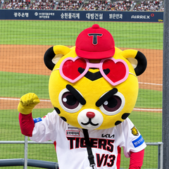<br/><b>임형준</b><br/>데이터 · RAG · LLM</td>
    <td align="center"><br/><b>이현준</b><br/>인프라 · RAG · LLM</td>
    <td align="center"><br/><b>최인영</b><br/>프론트엔드</td>
    <td align="center"><br/><b>김진화</b><br/>DB</td>
  </tr>
  <tr>
    <td align="center"><a href="https://github.com/Seongho-haru"></a></td>
    <td align="center"><a href="https://github.com/HyeongJjun"></a></td>
    <td align="center"><a href="https://github.com/gksrkd2"></a></td>
    <td align="center"><a href="https://github.com/inyoung9629"></a></td>
    <td align="center"><a href="https://github.com/masquerade0425-hash"></a></td>
  </tr>
</table>

<!-- 아래 표는 git 커밋 기록으로 추정한 초안입니다. 팀원 확인 후 수정하세요. -->

| 이름 | 담당 | 주요 작업 |
| --- | --- | --- |
| 윤성호 | 백엔드 | 인증(JWT) · 채팅 API · 코스 CRUD · 야구 SQL 조회 서비스, PR 리뷰·머지 |
| 임형준 | 팀장 · 데이터 · RAG · LLM | 데이터 수집·전처리, 청킹·임베딩(pgvector), RAG·에이전트 파이프라인, RAG 성능 평가 , 검색(pgvector), 프롬프트, README · 산출물 문서, PR 리뷰·머지 |
| 이현준 | 인프라 · RAG · LLM  | Docker Compose, GitHub Actions CI/CD, EC2 배포, 구장정보 에이전트, 검색(pgvector), 프롬프트 |
| 최인영 | 프론트엔드 | 데이터 수집 , Next.js 화면, 직관 코스 기능 구현· 커뮤니티 · 회원 UI |
| 김진화 | DB | baseball 도메인 ERD · DB 스키마, 사용자 테스트(임시) |


---

## 2. 프로젝트 기간

**2026.08.31 ~ 2026.09.17** (약 2.5주)

<!-- 필요하면 WBS 이미지나 간트 표를 넣으세요. -->

| 기간 | 내용 |
| --- | --- |
| 08.31 ~ 09.06 | 기획, 데이터 출처 조사, API 키 발급 |
| 09.07 ~ 09.08 | 데이터 수집 · 전처리 |
| 09.09 ~ 09.10 | 청킹 · 임베딩 · 벡터 DB 적재 |
| 09.11 ~ 09.14 | RAG 체인 · 백엔드 API · 프론트 연동, RAG 평가 |
| 09.15 ~ 09.17 | 에이전트 파이프라인 통합, 배포, 문서화 |

---

## 3. 프로젝트 개요

### 3.1 프로젝트 소개

<!-- 3줄 요약: 누구를 위해 / 무엇을 / 어떻게 -->

> 야구장에 처음 가는 팬도 **"잠실 경기 전에 뭐 먹고, 주차는 어디에, 뭘 가져가면 안 돼?"** 를 한 번에 물어보고,
> **경기 전 맛집 → 경기 관람 → 경기 후 핫플레이스** 코스를 지도로 받아보는 KBO 직관 안내 챗봇입니다.

### 3.2 프로젝트 배경

<!-- 기사 캡처: 각 기사 제목 부분을 직접 캡처해서 아래 파일명으로 docs/images/background/ 에 넣으세요. -->

<table>
  <tr>
    <td align="center" width="33%"><a href="https://www.mt.co.kr/sports/2026/09/13/2026091215014823882">📰 기사 보기</a><!-- 캡처 준비되면: <a href="https://www.mt.co.kr/sports/2026/09/13/2026091215014823882"></a> --><br/><sub>머니투데이 · 2026.09.13<br/>KBO 리그 역대 최다 관중 새 역사 쓰나</sub></td>
    <td align="center" width="33%"><a href="https://www.hankyung.com/article/2025090560771">📰 기사 보기</a><!-- 캡처 준비되면: <a href="https://www.hankyung.com/article/2025090560771"></a> --><br/><sub>한국경제 · 2025.09.05<br/>女心 훔친 프로야구…1200만 관중 시대</sub></td>
    <td align="center" width="33%"><a href="https://www.etoday.co.kr/news/view/2512560">📰 기사 보기</a><!-- 캡처 준비되면: <a href="https://www.etoday.co.kr/news/view/2512560"></a> --><br/><sub>이투데이 · 2025.10.06<br/>원정 팬이 만든 체류형 관광</sub></td>
  </tr>
</table>

#### ① KBO 리그, 2년 연속 역대급 흥행

<p align="center">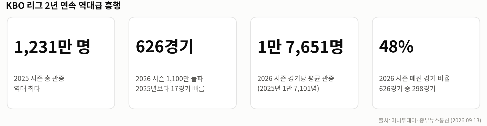</p>

| 지표 | 수치 | 출처 |
| --- | --- | --- |
| 2025 시즌 총 관중 | **1,231만 2,519명** (역대 최다) | [머니투데이, 2026.09.13][mt] |
| 2026 시즌 1,100만 돌파 | **626경기 만** (2025년보다 17경기 빠름) | [중부뉴스통신, 2026.09.13][jb] |
| 2026 시즌 경기당 평균 관중 | **1만 7,651명** (2025년 1만 7,101명) | [중부뉴스통신][jb] |
| 2026 시즌 매진 경기 | 626경기 중 **298경기 (약 48%)**, 좌석 점유율 85.2% | [중부뉴스통신][jb] |

- 2026 WBC에서 대표팀이 **17년 만에 8강**에 오르며 붙은 열기가 그대로 리그로 이어졌다는 분석이 나옵니다. ([머니투데이][mt])
- 경기 시간 단축(평균 3시간 2분, 전년보다 8분 감소)과 자동 볼 판정 시스템(ABS) 도입이 빠른 경기를 좋아하는 MZ세대에게 통했다는 평가도 있습니다. ([한국경제, 2025.09.05][hk])

#### ② 새로 유입된 팬은 "야구장 초보", 그중에서도 2030 여성

<p align="center">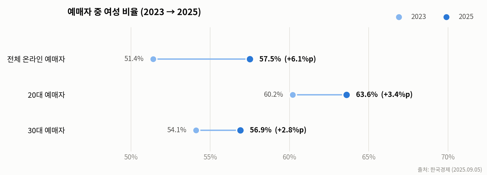</p>

| 지표 | 수치 | 출처 |
| --- | --- | --- |
| 온라인 예매자 중 여성 비율 | **57.5%** (2023년 51.4%) | [한국경제][hk] |
| 20대 예매자 중 여성 비율 | **63.6%** | [한국경제][hk] |
| 1년 사이 야구 관심이 늘었다는 20대 | **63.3%** | [2025 KBO 팬 성향 조사, 데일리비즈온 2026.01.27][fan] |
| 올해 직접 관람 경험 / 내년 관람 의향 | **61.4% / 79.9%** | [팬 성향 조사][fan] |
| 야구 정보를 모바일로 찾는 비율 | **84.3%** | [팬 성향 조사][fan] |

- 2030 여성 팬덤, 스타 선수, 캐릭터 협업 굿즈, 구단 유튜브·SNS 콘텐츠, 야구장 시설 개선이 인기 요인으로 꼽힙니다. ([마이데일리, 2025.12.06][md])

#### ③ 직관은 "경기 관람"이 아니라 "먹고 · 놀고 · 자는 여행"

<p align="center">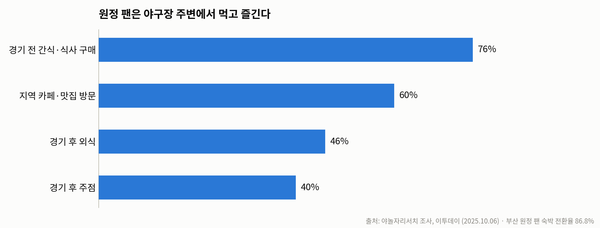</p>

| 원정 팬 행동 (야놀자리서치) | 비율 |
| --- | --- |
| 경기 전 간식 · 식사 구매 | **76%** |
| 지역 카페 · 맛집 방문 | **60%** |
| 경기 후 외식 / 주점 | **46% / 40%** |
| 부산 원정 팬 숙박 전환율 | **86.8%** |

출처: [이투데이, 2025.10.06][et]

- 현대경제연구원은 프로야구로 생기는 연간 소비 지출 효과를 **약 1조 1,121억 원**으로 추산했습니다. ([위키트리, 2026.04.25][wt])

### 3.3 문제 정의

| 사용자가 겪는 불편 | 현재 상황 |
| --- | --- |
| 구장 정보가 흩어져 있음 | 반입 규정 · 주차 · 좌석 · 재입장 규정이 **10개 구단 홈페이지에 제각각** 있고, 일부는 공식 자료가 없음 |
| 맛집 · 코스는 따로 찾아야 함 | 구장 정보는 구단 사이트, 주변 맛집은 지도 앱, 일정 · 순위는 포털에서 따로 확인 |
| 초보 팬은 무엇을 물어야 할지 모름 | "라팍", "챔필", "엔팍" 같은 별칭과 구단마다 다른 좌석 등급명 |
| 비공식 정보의 신뢰도 | 블로그 · 커뮤니티 정보와 공식 정보가 섞여 있어 믿고 따르기 어려움 |
| 일반 LLM의 한계 | 오늘 날짜 · 순위 · 가격을 지어내거나(환각), 구장별 규정 차이를 모름 |

> **→ 구장 정보, 경기 데이터, 주변 장소를 한 대화에서 묻고, 근거 등급까지 알려주는 직관 안내 챗봇이 필요합니다.**

### 3.4 핵심 기능

| 기능 | 설명 |
| --- | --- |
| 💬 구장 안내 Q&A (RAG) | 교통 · 주차 · 좌석 · 가격 · 반입 · 재입장 · 편의시설을 문서 검색으로 답변 |
| 📊 경기 데이터 조회 | 일정 · 순위 · 티켓 가격을 **읽기 전용 DB 조회 도구**로 정확히 답변 |
| ⏱️ 실시간 응답 · 진행 표시 | 답변을 글자 단위로 바로 보여 주고, 만드는 동안 "경기 일정 조회 중 → 완료"처럼 **어떤 조회를 하는지** 함께 표시 |
| 🗺️ 직관 코스 추천 | 경기 전 맛집 → 구장 → 경기 후 코스를 만들고 **카카오맵에 자동 표시** |
| 🏷️ 근거 등급 표시 | 공식 / 공식 확인 전 / 비공식 / 외부 서비스 정보에 따라 말투를 다르게 |
| 👥 커뮤니티 · 코스 공유 | 자유 · 구단별 게시판, 승부 예측, 코스 저장 · 좋아요 · 공유 (JWT 회원) |
| 🧭 첫 사용자 가이드 | 코스 작성 화면의 **12단계 스포트라이트 가이드**(샘플 화면에서 구장 선택 → 출발점 → 챗봇 코스 요청 → 저장까지 따라 하기), 챗봇 예시 질문 버튼, 구장 페이지 "첫 직관 준비" 안내 |

### 3.5 기대 효과

- **직관 준비 시간 단축** — 구단 홈페이지 · 지도 앱 · 포털을 오가던 확인을 대화 한 번으로
- **원정 팬 소비를 구장 주변으로 연결** — 경기 전후 식당 · 카페 · 명소를 경기 시간에 맞춰 제안
- **잘못된 안내 감소** — 공식 · 비공식을 구분하고, 모르는 것은 모른다고 답해 현장 혼란을 줄임

---

## 4. 요구사항 명세서

> 과정 요구사항 원문(회원 · 메인 · 코스 작성 · 챗봇 · 코스 공유 · 반응형)에 팀이 정한 LLM · 신뢰성 요구사항을 더해 정리했습니다.
> 상태: ✅ 구현 · 🟡 일부 구현

### 4.1 기능 요구사항

| ID | 구분 | 요구사항 | 구현 내용 | 상태 |
| --- | --- | --- | --- | :---: |
| FR-01 | 회원 | 회원가입 (아이디 · 비밀번호 · 이름 · 이메일 · 정책 동의) | `/signup`, 필수 2개 · 선택 1개 약관 동의 | ✅ |
| FR-02 | 회원 | 로그인 · 로그아웃 · 로그인 유지 | `/login`, JWT(SimpleJWT) 발급 · 갱신 · 로그아웃 | ✅ |
| FR-03 | 회원 | 소셜 로그인 | 카카오 버튼 자리만 두고, 지금은 아이디 로그인으로 안내 | 🟡 |
| FR-04 | 회원 | 계정 관리 | 마이페이지(내 코스 삭제 · 찜한 코스 해제), 아이디 찾기, 비밀번호 · 이메일 변경 | ✅ |
| FR-05 | 메인 | 메인 페이지 | `/` 서비스 소개, 인기 코스, 구장 · 구단 바로가기 | ✅ |
| FR-06 | 코스 작성 | 카카오맵으로 코스 만들기 | `/routes/new`, 구장 반경 2.5km 장소 탐색 · 방문 순서 지정 | ✅ |
| FR-07 | 코스 작성 | CKEditor 5로 본문 작성 | `components/editor.tsx` | ✅ |
| FR-08 | 코스 작성 | 마커 · 경로(폴리라인) 좌표 저장 | 방문 장소 좌표와 경로를 코스와 함께 저장 | ✅ |
| FR-09 | 코스 작성 | AI 챗봇 보조 | 챗봇 코스 추천 → 카카오맵에 자동 표시 · 저장, 지도에 찍은 출발지부터 이어지는 코스 자동 완성 | ✅ |
| FR-10 | 챗봇 | 야구 정보 제공 | 기초 규칙(RAG) + 일정 · 순위 · 선수 · 티켓 가격(읽기 전용 DB 도구) | ✅ |
| FR-11 | 챗봇 | 구장 정보 제공 | 교통 · 주차 · 좌석 · 반입 · 재입장 · 편의시설 · 주변 장소 | ✅ |
| FR-12 | 챗봇 | 실시간 응답 · 진행 표시 | SSE로 글자 단위 표시, "경기 일정 조회 중 → 완료" 진행 로그 | ✅ |
| FR-13 | 챗봇 | 대화 기록 · 이용 권한 | 회원 세션 · 대화 기록 저장 · 대화 목록에서 삭제. 질문은 로그인 후 가능, 비로그인은 둘러보기만 | ✅ |
| FR-14 | 코스 공유 | 코스 목록 + 페이징 | `/routes` 정렬 · 페이지 이동 | ✅ |
| FR-15 | 코스 공유 | 코스 상세 · 좋아요 · 수정 · 삭제 · 공유 | `/routes/[id]` 지도 · 방문 순서 표시, 작성자만 수정 · 삭제 | ✅ |
| FR-16 | 커뮤니티 | 게시판 · 승부 예측 | 자유 · 구단별 게시판, 댓글 · 이미지, 경기별 승부 예측 투표 | ✅ |
| FR-17 | 야구 데이터 | 일정 · 순위 · 선수 · 하이라이트 화면 | `/schedule` · `/standings` · `/highlights` | ✅ |
| FR-18 | 반응형 | PC · 태블릿 · 모바일 | 모바일 우선 레이아웃, 화면 폭에 따라 단 수 조절 | ✅ |
| FR-19 | 관리자 | 회원 · 게시글 · 신고 · 야구 데이터 관리 | 관리자 마이페이지(신고 보류 · 숨김 · 삭제), `/admin`, 채팅 진행 기록 상세는 관리자만 조회 | ✅ |
| FR-20 | 온보딩 | 첫 사용자 가이드 | 코스 작성 12단계 스포트라이트 가이드(driver.js, 샘플 화면이라 실제 저장 · 요청 없음), 챗봇 예시 질문, 야구 가이드(`/guide`) 안내 배너 | ✅ |

### 4.2 비기능 요구사항

| ID | 구분 | 요구사항 | 구현 · 검증 | 상태 |
| --- | --- | --- | --- | :---: |
| NFR-01 | 정확성 | 근거 있는 답변, 모르는 것은 모른다고 답하기 | 근거 등급별 말투, 골든셋 생성 정답률 **92.7%** · 검색 Hit@5 **95.6%** | ✅ |
| NFR-02 | 범위 제한 | 야구 · 직관과 무관한 질문 차단 | dispatcher 규칙으로 LLM 호출 없이 고정 안내 (TC-06 · TC-13) | ✅ |
| NFR-03 | 응답성 | 기다리는 동안 빈 화면 없애기 | 토큰 스트리밍 + 도구 진행 표시 | ✅ |
| NFR-04 | 안정성 | 에이전트가 실패해도 답변 | 도메인 에이전트 대체 경로, 브라우저 연결 끊김 처리 | ✅ |
| NFR-05 | DB 보안 | 챗봇이 데이터를 바꾸지 못하게 | 읽기 전용 계정 · SELECT 1문장 검증 · 행 수 · 시간 제한 ([5.3](#53-db-조회-안전장치)) | ✅ |
| NFR-06 | 비밀 정보 | API 키 · 비밀번호 노출 금지 | `.env` · GitHub Secrets, 외부 API는 백엔드에서만 호출 | ✅ |
| NFR-07 | 배포 보안 | 허용한 주소로만 접속 | `DJANGO_ALLOWED_HOSTS` 환경변수, `*` 전체 허용 차단 | ✅ |
| NFR-08 | 배포 · 운영 | 한 번에 띄우고 자동 배포 | Docker Compose, GitHub Actions CI/CD → EC2 | ✅ |
| NFR-09 | 유지보수 | 프론트 · 백엔드 응답 형식 일치 | OpenAPI 계약 자동 생성 · 검사, 단위 테스트 | ✅ |
| NFR-10 | 데이터 정책 | 수집이 허용된 곳만, 저작권 데이터 제외 | robots.txt 확인, 응원가 가사 등 제외 ([5.1](#51-데이터-수집-정책)) | ✅ |

---

## 5. 정책 및 신뢰성 설계

### 5.1 데이터 수집 정책

- **KBO 공식 홈페이지(koreabaseball.com)는 수집하지 않음** — robots.txt 확인 후 제외. 일정 · 순위는 TVING API, 예매 정책은 yagu.today(robots 허용)로 대체
- **구단 홈페이지 10곳은 접근 가능 여부를 개별 확인** — 자동 수집이 막힌 곳은 팀원이 직접 보고 옮겨 적는 수동 조사로 대체하고 출처 URL · 확인일을 남김
- **저작권 이슈 데이터 제외** — 응원가 가사, 선수 개인 기록 TOP5는 수집 범위에서 뺌
- **원본 보존** — `data/raw/`는 어떤 스크립트도 덮어쓰지 않고, 결과는 `data/preprocessed/`에만 저장

### 5.2 근거 등급 (답변 신뢰성)

| 등급 | 기준 (`status` · `evidence_type`) | 답변 방식 |
| --- | --- | --- |
| OFFICIAL | 구단 공식 · CONFIRMED | 단정해서 안내 |
| UNCERTAIN | PARTIAL · RECHECK 등 | "공식 확인 전 정보라 달라질 수 있습니다" |
| UNOFFICIAL | 블로그 · SNS 조사 | "비공식 정보라 현장과 다를 수 있습니다"로 시작 |
| THIRD_PARTY | 카카오 등 외부 API | "외부 서비스 기준 정보라 방문 전 확인을 권합니다" |

- 확정되지 않은 행은 **인덱싱 단계에서 본문에도** "공식 확인 전 정보" 문구를 넣어, 프롬프트 규칙과 함께 이중으로 막습니다.
- 인덱싱된 3,839청크 중 OFFICIAL 계열 32.6%, THIRD_PARTY 52.4%, UNOFFICIAL 13.0%입니다.

### 5.3 DB 조회 안전장치

| 장치 | 내용 |
| --- | --- |
| 읽기 전용 계정 | 챗봇은 `BASEBALL_DB_USER` 전용 계정으로만 조회 (`provision_baseball_reader`가 컨테이너 시작 때 권한 준비) |
| SQL 검증기 | sqlglot으로 파싱해 **SELECT 1문장**, 허용된 테이블 · 함수만 통과 (`pg_sleep` 등 22개 패턴 거부 테스트) |
| 실행 한도 | 최대 200행 · 3초 타임아웃 · 락 대기 1초 · SQL 32KB · 응답 1MB |
| 고정 SQL 우선 | 일정 · 순위 · 가격 · 예매정책은 **코드에 고정한 SELECT**를 쓰는 전용 도구로 조회 |
| 자유 SQL 제한 | 전용 도구로 안 되는 질문만, **스키마 조회 도구를 먼저 부른 경우에만** `execute_baseball_select` 허용 (최대 50행) |
| 답변 규칙 | SQL · 테이블명 · 도구 이름 같은 내부 용어는 답변에 쓰지 않음 |
| 범위 밖 질문 차단 | 축구 · 영화 등 무관한 주제는 LLM 없이 고정 안내. **코딩 · 숙제 · 주식 · 코인 · 부동산 · 자동차 구매**처럼 직관과 접점이 없는 주제는 "야구 좋아하는데 코딩 알려줘"처럼 야구 단어가 섞여도 차단 |
| 진행 기록 공개 범위 | 화면에는 도구 이름 · 단계 · 상태만 보냄. 입력값 · 결과는 허용한 키만 걸러 **관리자 계정에만** 표시 (SQL · 스키마 · URL은 저장하지 않음) |

### 5.4 코스 장소 선정 기준

> 상세: [`docs/references/코스장소_선정기준_핫플정의_20260916.md`](docs/references/코스장소_선정기준_핫플정의_20260916.md)

코스는 **경기 전 식사 → 구장 → 경기 후 갈 곳** 순서입니다. 인기 데이터(평점·리뷰)가 없기 때문에 "핫플레이스"라고 부르지 않고, 아래 규칙으로만 장소를 고릅니다.

| 종류 | 포함 | 제외 | 기본 반경 |
| --- | --- | --- | --- |
| 경기 전 식사 | 카카오 음식점(FD6) | 술집, 구장 안 매대 | 도보 20분 (1.6km) |
| 카페·디저트 | 카카오 카페(CE7) | 유아 놀이시설, 만화방·보드카페, 구장 안 매대 | 도보 20분 (1.6km) |
| 주점 | 음식점 중 술집 | 구장 안 매대, **운전·가족·아이 동행 시** | 도보 20분 (1.6km) |
| 야간 명소 | 관광명소(AT4) 중 테마거리·전망대·도심 산책길·호수 | 산·계곡·저수지·숲·도예공방·온천·수목원 등 | 도보 30분 (2.5km) |

- **구장 안 매대 판정**: `in_stadium_flag=Y` 이거나, 이름에 "OO야구장점 · NC파크점 · 2층3루" 같은 구장명·좌석 구역이 들어간 곳 (1,008건 중 182건)
- **선정 방식 (현재 코드)**: 카테고리별 벡터 검색 → 동행 금지 업종 · 반경 · 중복 브랜드 제외 → LLM이 후보 키만 선택(후보마다 "구장 북동쪽 900m"처럼 방위 표시) → 총 도보가 3km를 넘거나 한 구간이 1.8km를 넘으면 같은 종류의 더 가까운 곳으로 교체 (`course/geo.py`)
- **출발지가 있을 때**: 코스 작성 화면에서 지도에 출발지를 찍으면 출발지 → 1번 → 2번 → 구장 → 경기 후 순서로, **앞 지점 주변(800m → 1.5km → 3km)을 새로 검색**하고 구장 쪽으로 다가가는 곳을 우선합니다. 경기 후 장소는 구장 1.5km 안에서 고릅니다. 산책(공원 · 산책로) · 실내 놀거리 · 숙박을 요청하면 그 단계도 넣고, "먹고 구장 갈래"처럼 **경기 전만** 요청하면 경기 후 장소는 붙이지 않습니다.
- **아직 코드에 반영하지 않은 정의**: 음식점 · 카페 반경 1.6km(지금은 2.5km, 촉박하면 1.2km), 구장 안 매대 182건 전체 제외(지금은 이름에 "야구장"이 들어간 음식점만 제외), 야간 명소의 산 · 계곡 제외, "남은 곳 중 랜덤" 선택 — 상세 문서 4-1의 할 일로 남아 있습니다.
- **표현 제한**: 근거 데이터가 없는 "맛있는 · 유명한 · 인기 많은" 같은 표현은 쓰지 않음

---

## 6. 수집된 데이터 및 데이터 전처리

> 🔴 필수 산출물 · 상세 문서: [`docs/deliverables/01_데이터수집_전처리.md`](./docs/deliverables/01_데이터수집_전처리.md) · [`data/preprocessed/README.md`](./data/preprocessed/README.md)

### 6.1 데이터 출처

| 출처 | 수집 방식 | 활용 | 비고 |
| --- | --- | --- | --- |
| 구단 공식 홈페이지 | 수동 조사 → xlsx → 정규화 스크립트 | 좌석 · 가격 · 교통 · 편의시설 · 부가콘텐츠 | OFFICIAL |
| TVING 내부 API | 스크립트 (`kbo_schedule.py`, `kbo_standing.py`) | 팀 순위 · 경기 일정 | 매일 갱신 |
| yagu.today | 크롤링 → 문장 파싱 (`parse_ticket_policy.py`) | 예매 정책 | THIRD_PARTY |
| Kakao Local API | REST API (`collect_kakao_places.py`, 반경 2.5km) | 구장 반경 음식점 · 카페 · 명소, 구장 좌표 | THIRD_PARTY |
| 자리어때 | 수동 조사 → 정규화 | 구장 내 먹거리 · 편의시설(굿즈샵 · 포토부스 · 물품보관함) 위치 | UNOFFICIAL |
| 블로그 · SNS | 수동 조사 → JSON | 재입장 규정 | UNOFFICIAL |

### 6.2 데이터 현황

| 파일 | 행 수 | 카테고리 |
| --- | ---: | --- |
| `kbo_schedule_full.csv` | 782 | SCHEDULE |
| `구장티켓가격.csv` | 740 | PRICE |
| `external_places.csv` | 1,008 | FOOD_OUT 405 · CAFE 405 · SPOT 198 |
| `구장먹거리_위치_자리어때.csv` | 385 | FOOD_IN |
| `구장먹거리_공식매점.csv` | 291 | (보존 · 인덱싱 제외) |
| `kbo_ticket_policy_structured.csv` | 244 | TICKET_POLICY |
| `구장편의시설.csv` / `구장편의시설_위치_자리어때.csv` | 207 / 100 | FACILITY |
| `구장좌석구역.csv` / `구장좌석도.csv` / `구장좌석경험.csv` | 192 / 10 / 8 | SEAT |
| `구장부가콘텐츠_공식.csv` | 68 | CONTENT |
| `구장교통정보.csv` / `구장잔여정보_좌석주차버스.csv` | 43 / 14 | TRANSPORT |
| `kbo_standing.csv` / `kbo_standing_history.csv` | 10 / 10 | STANDING |
| `구장운영정보.csv` | 9 | OPERATION |
| `stadium_coordinates.csv` | 9 | STADIUM |
| `docs/KBO_반입물품_재입장규정.json` | 공통 1 + 10구단 | CARRY_IN · REENTRY |
| `docs/기초규칙_요약본.md` | 11청크 | RULE |
| 기타 (`구장편의시설_보류이력` 8, `3차_신규확보데이터` 14, `kbo_schedule_postseason_tbd` 4) | 26 | 참조용 · 인덱싱 제외 |

### 6.3 전처리 파이프라인

<p align="center"><a href="https://raw.githubusercontent.com/SKNETWORKS-FAMILY-AICAMP/SKN34-3rd-5Team/develop/docs/images/data_pipeline.svg"></a></p>

<sub>▶ 선을 따라 흐름이 움직입니다 · 🔍 <b>그림을 누르면 크게 볼 수 있어요</b> (새 탭에서 크게 열림 · Ctrl + 휠로 더 확대) · 단계별 설명이 되는 <a href="./docs/architecture/data_pipeline.html">인터랙티브 HTML</a> (내려받아 브라우저로 열기)</sub>

### 6.4 전처리 규칙

- 원본(`data/raw`)은 수정하지 않고 결과만 `data/preprocessed`에 저장
- 구장 코드 9개 표준화: `JAMSIL · GOCHEOK · MUNHAK · SUWON · DAEJEON · DAEGU · GWANGJU · SAJIK · CHANGWON` (인천은 `MUNHAK`)
- 팀 코드 표준화: `LG, DOOSAN, KIWOOM, SSG, KT, HANWHA, SAMSUNG, KIA, LOTTE, NC`
- CSV는 `utf-8-sig`, 모든 행에 `status` · `evidence_type` 태깅 (세부값은 `evidence_subtype`에 보존)
- 가격 · 면수 · 시각은 **원문 그대로** (계산 · 반올림 금지), 좌석 등급명도 구단 표기 그대로 유지
- 보완 조사 결과는 오버레이 함수로 적용 (예: 대구 "대공원역" → "수성알파시티역", 2024 고시)
- `price_krw=0`(무료 요금) · NC 동적 가격 스냅샷 · 수치가 다른 주차 정보는 오류로 지우지 않고 답변 규칙으로 처리

### 6.5 청킹 · 임베딩

| 항목 | 설정 |
| --- | --- |
| 청킹 방식 | **1행 = 1청크**, 규칙 템플릿으로 `[구장 · 팀] 항목: 값 / …` 형태의 자기완결 텍스트 생성 (평균 218자). 반입 · 재입장 JSON은 코드값을 문장으로 변환, 기초규칙 md만 제목 단위 분할. LLM 문장화는 쓰지 않음 |
| 임베딩 모델 | OpenAI `text-embedding-3-small` (1536차원) · 100건씩 · 500건마다 체크포인트 |
| 벡터 DB | PostgreSQL 18 + pgvector · `llm_documentchunk` · HNSW (`m=16`, `ef_construction=64`, cosine) · 검색 시 `ef_search=200` |
| 총 청크 수 | **3,839** (17개 카테고리) |
| `doc_id` 규칙 | `{CATEGORY}_{SCOPE}_{자연키}` (예: `PRICE_SAJIK_…_WEEKEND_ADULT`, `CARRY_IN_COMMON_COMMON`). 자연키가 겹치는 17행은 `_2`, `_3` |

---

## 7. RAG · 에이전트 파이프라인 설계

> 🔴 필수 산출물 · 코드: [`backend/llm/rag/`](./backend/llm/rag/), 인덱싱: [`build_index.py`](./backend/llm/management/commands/build_index.py) · 상세: [`docs/deliverables/03_RAG_벡터DB_연동코드.md`](./docs/deliverables/03_RAG_벡터DB_연동코드.md)

### 7.1 전체 흐름

<p align="center"><a href="https://raw.githubusercontent.com/SKNETWORKS-FAMILY-AICAMP/SKN34-3rd-5Team/develop/docs/images/chat_pipeline.svg">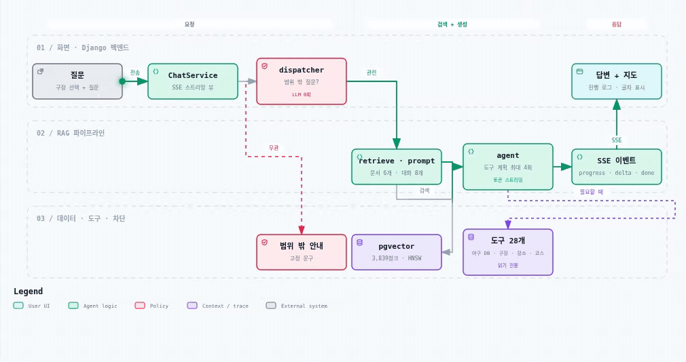</a></p>

<sub>▶ 선을 따라 흐름이 움직입니다 · 🔍 <b>그림을 누르면 크게 볼 수 있어요</b> (새 탭에서 크게 열림 · Ctrl + 휠로 더 확대) · 단계별 설명이 되는 <a href="./docs/architecture/chat_pipeline.html">인터랙티브 HTML</a> (내려받아 브라우저로 열기)</sub>

```
질문 → dispatcher(범위 밖 질문 차단, LLM 0회)
     → retrieve(임베딩 1회) → build_prompt
     → 도구 계획(LLM, 도구 최대 4회) → 최종 답변(LLM 토큰 스트리밍)
     → SSE: checkpoint → progress(도구 진행) … → delta(답변 조각) … → done(코스 · 지도)
```

- **채팅 화면(SSE)** — `assistant.stream_answer`: `retrieve` → `build_prompt` → 도구 계획 루프(`bind_tools`, LLM 1~5회) → 최종 답변 `model.stream`(LLM 1회)
- **스트리밍이 아닌 호출** (`chat_chain().invoke`) — `retrieve | build_prompt | agent(create_agent) | parse_output` 체인

- **스위치 없음** — 모든 질문이 이 흐름으로 갑니다. 테스트 러너 안에서만 꺼져 기존 회귀 테스트를 보호합니다.
- **실시간 응답** — 도구 계획 단계의 LLM 출력은 화면에 보내지 않고, 마지막 답변만 토큰이 오는 대로 `delta` 이벤트로 흘립니다 (`assistant.stream_answer`).
- **진행 표시** — 검색 · 도구 호출이 시작 · 완료 · 실패할 때마다 `progress` 이벤트를 보내고, 회원 대화는 `ChatProgressEvent`에 저장해 대화를 다시 열어도 도구 로그가 남습니다 (`llm/progress.py`).
- **범위 밖 차단** — 무관 주제 단어가 있고 야구 단어가 없으면 차단합니다. 코딩 · 숙제 · 주식 · 코인 · 자동차 구매 등은 야구 단어가 섞여도 차단합니다 (`dispatcher.HARD_OFF`).
- **실패 대체** — 답변 조각을 보내기 전에 에이전트가 실패하면 같은 질문을 기존 도메인 모듈로 다시 답합니다 (`route`에 `agent:error>` 기록).

### 7.2 에이전트 도구

모든 답변 에이전트(assistant · club · venue · course · nearby)가 같은 통합 도구 집합을 공유하며, 이름이 겹치면 assistant 전용 구현을 우선합니다.

> 전체 도구의 입력·제약·안전장치는 [LLM 에이전트 도구 명세](./docs/api/agent-tools.md)를 참고합니다. 도구는 내부 LangChain 인터페이스이며 HTTP API가 아닙니다.

| 앱 | 주요 도구 | 역할 | 상세 문서 |
| --- | --- | --- | --- |
| `baseball` | `get_games`, `get_standings`, `get_stadium`, 좌석·티켓·구장시설 조회, 제한된 SQL | 경기·순위와 구장 정보를 조회하고, 전용 도구로 부족한 질문은 읽기 전용 `SELECT`로 보완 | [야구·구장 도구](./docs/api/agent-tools.md#야구구장-도구) · [SQL 도구](./docs/api/agent-tools.md#제한된-범용-sql-도구) |
| `travel` | `search_places`, `search_courses`, `get_course`, `get_directions`, `search_tourism`, `get_weather` | 주변 장소·저장 코스·이동 경로·관광지·경기 시각 날씨 조회 | [장소·코스·여행 도구](./docs/api/agent-tools.md#장소코스여행-도구) |
| `community` | `search_community_posts`, `get_prediction_games` | 공개 게시글과 승부예측 대상 경기·익명 팬 투표 집계 조회 | [커뮤니티 도구](./docs/api/agent-tools.md#커뮤니티선수-도구) |
| `tving` | `search_players` | 구단·선수 코드·이름으로 선수 정보를 찾고 필요하면 저장 자료를 갱신 | [선수 도구](./docs/api/agent-tools.md#커뮤니티선수-도구) |
| `llm` | `search_kbo_documents`, `search_documents_tool`, `search_nearby_places`, `plan_course` | RAG 근거를 추가 검색하고 주변 장소 조회와 직관 코스 초안을 조정 | [문서 검색 도구](./docs/api/agent-tools.md#문서-검색-도구) · [코스 도구](./docs/api/agent-tools.md#장소코스여행-도구) |

`accounts`는 에이전트에 회원 관리 도구를 제공하지 않습니다. 코스 생성 도구도 초안만 반환하며 실제 저장은 사용자가 코스 API에서 수행합니다.

### 7.3 프롬프트 설계

- **참고 문서 먼저** — 검색 결과 6개를 `[번호] 등급 · 구장 · 분류` 머리말과 함께 넣음
- **정본 우선순위** — 일정 · 순위 · 결과 · 가격은 참고 문서보다 **DB 도구 결과를 믿도록** 명시, "몇 경기"는 도구의 `count`를 그대로 사용
- **지어내기 금지** — 경기 시각 · 가격 · 점수 · 순위 · 주소 · 장소 이름은 문서나 도구 결과에 있는 것만
- **되묻기 · 고정 답변** — 구장이 필요한데 없으면 되묻고, 취소 · 환불은 "예매처에 문의" 고정 문구
- **근거 등급별 말투** — UNOFFICIAL · UNCERTAIN · THIRD_PARTY면 마지막 줄에 확인 안내
- **오늘 날짜 · 화면 구장 주입** — "다음 경기", "오늘" 같은 상대 표현을 바르게 계산
- **질문 유형 힌트** — 코스 · 주변 장소 질문이면 어떤 도구를 먼저 쓸지 한 줄 힌트 (분기가 아니라 힌트)
- **내부 용어 숨김** — SQL · 테이블명 · 도구 이름 · "참고 문서" 같은 말은 답변에 쓰지 않음

### 7.4 코스 추천 흐름

<p align="center"><a href="https://raw.githubusercontent.com/SKNETWORKS-FAMILY-AICAMP/SKN34-3rd-5Team/develop/docs/images/course_sequence.svg">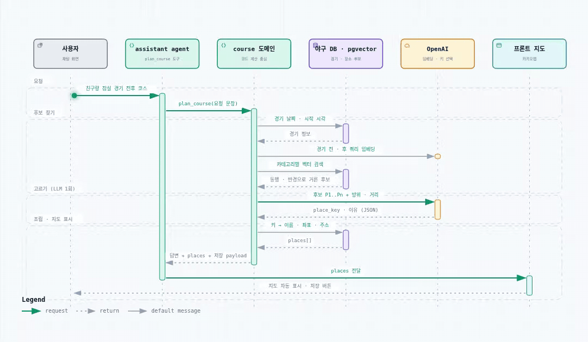</a></p>

<sub>▶ 선을 따라 흐름이 움직입니다 · 🔍 <b>그림을 누르면 크게 볼 수 있어요</b> (새 탭에서 크게 열림 · Ctrl + 휠로 더 확대) · 단계별 설명이 되는 <a href="./docs/architecture/course_sequence.html">인터랙티브 HTML</a> (내려받아 브라우저로 열기)</sub>

> **좌표 환각이 0인 이유**: LLM에게서 받는 것은 `place_key · phase · reason · intro`뿐이고, 이름 · 좌표 · 주소 · 시각 · 거리는 전부 DB 값이거나 코드가 계산한 값입니다.

- **출발지 기준 코스** — 질문 앞에 `[출발지: 위도,경도]`가 붙은 코스 질문은 에이전트를 거치지 않고 course 도메인이 바로 답합니다 (`dispatcher._origin_course`). 각 단계는 앞 지점을 중심으로 카카오 장소를 새로 검색하고, LLM은 인트로와 장소별 한 줄 이유만 씁니다.
- **동선 보정** — 출발지가 없으면 LLM이 고른 코스의 총 도보를 재서 너무 길 때만 가까운 후보로 바꿉니다 (LLM 선택을 함부로 뒤집지 않도록 500m 이상 줄어들 때만).

### 7.5 RAG 성능 원칙 — 느리면 인덱싱과 런타임부터

| 원칙 | 우리 구현 | 상태 |
| --- | --- | :---: |
| 문서 로딩 · 청킹 · 임베딩 · 벡터 저장은 **요청마다 하지 않는다** | `build_index` 관리 명령으로만 수행, 서버는 적재된 테이블을 읽기만 함 | ✅ |
| 최초 전체 인덱싱 후 **바뀐 데이터만 증분** | 입력 fingerprint가 같으면 임베딩 체크포인트를 재사용해 API를 다시 부르지 않음. 테이블 적재는 아직 전체 교체 | 🔶 부분 |
| 요청 시에는 **검색 + 생성만** | `retrieve → agent`만 실행. 임베딩 클라이언트 · 체인은 서버 기동 후 한 번만 만들어 재사용 | ✅ |
| 느릴 때 **검색 / 리랭크 / 생성 시간을 따로** 잰다 | `retrieval_ms` · `llm_ms` · `timing.agent_ms` 기록, LangSmith로 질문 1건 = 트리 1개 | ✅ |

**실측 (club 골든셋 55문항, 2026-09-14 · `rag_test` 체인, LLM 1회 호출 기준)**

| 구간 | 중앙값 | 평균 | 최대 |
| --- | ---: | ---: | ---: |
| 검색 (필터 + HNSW + 키워드 재정렬) | **9 ms** | 10 ms | 29 ms |
| LLM 생성 | **2,643 ms** | 2,556 ms | 10,971 ms |
| 전체 | 2,661 ms | 2,567 ms | 10,993 ms |

➡️ 응답 시간의 **99% 이상이 LLM 생성**입니다. 벡터DB는 병목이 아니므로, 속도 개선은 정해진 질문을 DB 결과로 바로 답하기 · 도구 호출 수 제한(최대 4회) · 모델 설정 조정 쪽에서 합니다.

**실측 (스트리밍 파이프라인, 2026-09-16 · 로컬 Docker · 질문 5개 × 2회, 2회차 기준)**

| 질문 | 도구 | 첫 글자까지 | 전체 | LLM 호출 |
| --- | --- | ---: | ---: | :---: |
| 잠실 주차 얼마야? | 없음 (문서) | 4.3 s | 5.1 s | 2 |
| 야구 처음인데 스트라이크가 뭐야? | 없음 (문서) | 3.1 s | 5.2 s | 2 |
| 지금 KBO 순위 알려줘 | `get_standings` | 6.8 s | 8.8 s | 3 |
| 잠실 근처 숙소 추천 | `search_nearby_places` | 8.5 s | 11.1 s | 3 |
| 친구랑 잠실 경기 전후 걸어서 코스 짜줘 | `plan_course` | 16.1 s | 17.5 s | 4 + 카카오 · 길찾기 |
| **중앙값** | | **6.8 s** | **8.8 s** | |

- 도구가 필요 없는 질문도 **도구 계획 LLM 호출(약 3 ~ 4초)이 끝나야** 답변 스트리밍이 시작됩니다. 스트리밍은 전체 시간을 줄이는 게 아니라 마지막 1 ~ 2초의 답변 생성을 보이게 하는 것이고, 그 앞 구간은 진행 표시("순위 조회 중 → 완료")로 채웁니다.
- 코스 추천은 `plan_course` 안에서 LLM을 한 번 더 부르고 카카오 · 길찾기 API까지 호출해 가장 깁니다.
- 1회차 순위 질문은 OpenAI 응답 지연으로 **25초 타임아웃** → 예전 club 도메인으로 대체 답변(`agent:error>club>structured`, 27.1초). 실패 대체 경로가 실제로 동작한 사례입니다.
- 09-14 표(2.6초)는 LLM 1회 체인, 09-15 시나리오 표(3 ~ 7초)는 스트리밍 전 에이전트 기준이라 이 표와 직접 비교되지 않습니다. 측정 스크립트는 `dispatcher.stream`을 직접 호출해 첫 조각 · 완료 시각을 기록했습니다.

---

## 8. 시스템 아키텍처

> 🔴 필수 산출물 · 상세: [`docs/deliverables/02_시스템아키텍처.md`](./docs/deliverables/02_시스템아키텍처.md)

<p align="center"><a href="https://raw.githubusercontent.com/SKNETWORKS-FAMILY-AICAMP/SKN34-3rd-5Team/develop/docs/images/system_architecture.svg"></a></p>

<sub>▶ 선을 따라 흐름이 움직입니다 · 🔍 <b>그림을 누르면 크게 볼 수 있어요</b> (새 탭에서 크게 열림 · Ctrl + 휠로 더 확대) · 단계별 설명이 되는 <a href="./docs/architecture/system_architecture.html">인터랙티브 HTML</a> (내려받아 브라우저로 열기)</sub>

| 계층 | 구성 | 역할 |
| --- | --- | --- |
| Client | Next.js 16 · React 19 · Kakao Map SDK | 채팅, 지도 · 코스, 일정 · 순위, 커뮤니티 화면 |
| Gateway | Nginx `:80` | `/` → frontend, `/api/` → backend |
| API | Django 6.1 · DRF · SimpleJWT | 인증, 채팅(SSE 스트리밍 · 진행 표시), 코스, 커뮤니티, 야구 데이터 API |
| LLM | LangChain · OpenAI (Responses API) | 검색 → 프롬프트 → 도구 계획(도구 28개) → 답변 토큰 스트리밍 |
| Vector DB | PostgreSQL 18 + pgvector | 3,839개 문서 청크 + 메타데이터(JSONB) |
| RDB | PostgreSQL 18 (같은 인스턴스) | 야구 19개 테이블 · 회원 · 채팅 · 코스. 챗봇은 읽기 전용 계정으로만 조회 |
| Storage · Mail | MinIO · Mailpit | 커뮤니티 이미지, 비밀번호 재설정 메일 |
| Ops | Docker Compose · GitHub Actions → EC2 · LangSmith | 빌드 · 배포, LLM 호출 추적 |

> 다이어그램 전체 목록: [`docs/architecture/README.md`](./docs/architecture/README.md)

**인덱싱과 서빙을 분리**했습니다. 무거운 작업(파일 로딩 · 청킹 · 임베딩 · 적재)은 오프라인 `build_index`가 한 번 하고, 요청 때는 검색과 생성만 합니다.

---

## 9. 데이터베이스 설계

<p align="center"><a href="https://raw.githubusercontent.com/SKNETWORKS-FAMILY-AICAMP/SKN34-3rd-5Team/develop/docs/images/erd.svg">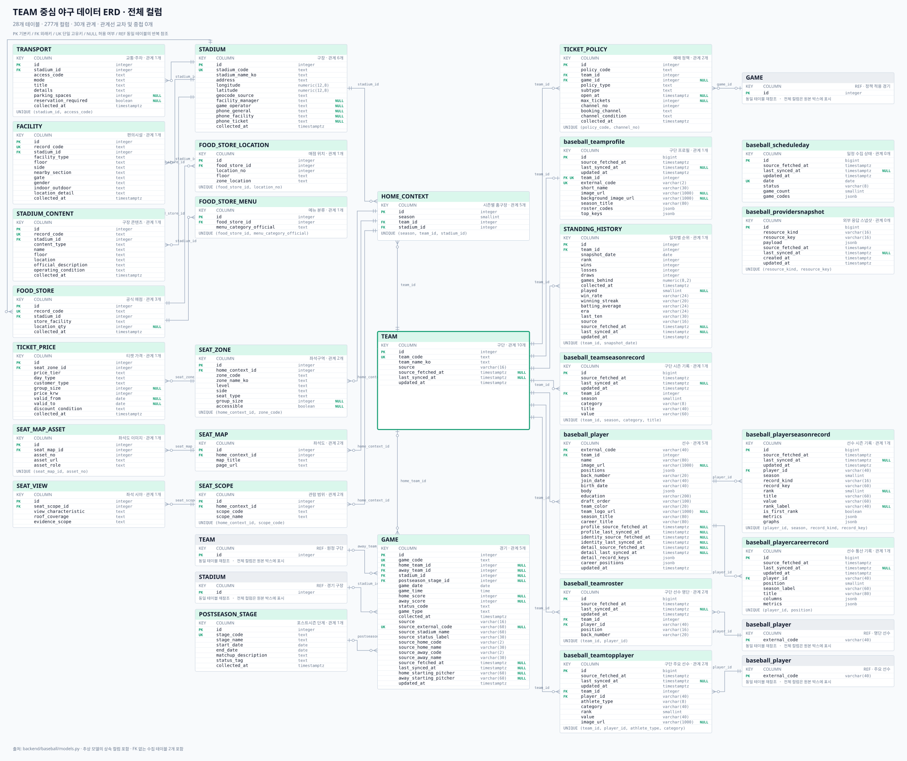</a></p>
<p align="center"><sub>🔍 <b>그림을 누르면 크게 볼 수 있어요</b> (Ctrl + 휠로 더 확대)</sub></p>


| 영역 | 주요 테이블 |
| --- | --- |
| 벡터 검색 | `llm_document`, `llm_documentchunk` (pgvector · HNSW) |
| 채팅 | `ChatSession`, `ChatMessage`, `ChatTurn` (답변 중단 · 확정 처리) |
| 야구 데이터 | `GAME`, `STANDING_HISTORY`, `TICKET_PRICE`, `SEAT_ZONE`, `TICKET_POLICY` 등 19개 (`baseball` 앱) |
| 회원 · 커뮤니티 · 코스 | 회원 · JWT blacklist, 게시글 · 초안 · 이미지 · 승부 예측, `Course` · `CourseStop` · 장소 · 길찾기 캐시 |

---

## 10. 디렉토리 구조

```text
SKN34-3rd-5Team/
├── backend/                     # Django
│   ├── config/                  # settings · urls
│   ├── accounts/                # 회원 · JWT
│   ├── baseball/                # 야구 정형 데이터 · SQL 조회 서비스(검증기)
│   ├── community/               # 게시판 · 이미지 · 승부 예측
│   ├── travel/                  # 코스 · 장소 · 길찾기 · 관광 · 날씨
│   ├── tving/                   # 당일 경기 · 선수 정보
│   ├── llm/
│   │   ├── chat_service.py      # 채팅 서비스 (RAG 체인 연결 지점)
│   │   ├── models.py            # DocumentChunk (pgvector · HNSW)
│   │   ├── management/commands/ # build_index · check_index · rag_check · langsmith_eval
│   │   └── rag/
│   │       ├── pipeline.py      # 백엔드 진입점
│   │       ├── dispatcher.py    # 범위 판단 · 실패 시 대체 경로
│   │       ├── persona.py       # 말투 · 경고 문구
│   │       ├── assistant/       # ★ retrieve → prompt → agent → parse
│   │       ├── club/ venue/     # 도메인별 검색 · 프롬프트 (대체 경로)
│   │       ├── course/          # 직관 코스 추천
│   │       └── nearby/          # 카카오 주변 장소
│   ├── crawling/                # TVING 일정 · 순위, 카카오 수집
│   └── preprocessing/           # 정규화 · 구조화 스크립트
├── frontend/                    # Next.js 16 (App Router)
├── data/
│   ├── raw/                     # 원본 (자동으로 덮어쓰지 않음)
│   └── preprocessed/            # 전처리 결과 CSV 21종
├── docs/
│   ├── deliverables/            # 🔴 필수 산출물 문서 4종
│   ├── architecture/            # archify 인터랙티브 HTML · 원본 JSON
│   ├── images/                  # README · 산출물 그림 (GIF · PNG)
│   └── test_results/            # 최종 평가 결과 CSV · 골든셋
├── rag_test/                    # 골든셋 평가 스크립트 (STEP 1~5)
├── contracts/openapi.yaml       # API 계약
├── nginx/
├── .github/workflows/           # CI/CD
└── docker-compose.yml
```

---

## 11. Tech Stack

<table>
  <tr><th>구분</th><th>기술</th></tr>
  <tr><td align="center"><b>Frontend</b></td><td>    </td></tr>
  <tr><td align="center"><b>Backend</b></td><td>    </td></tr>
  <tr><td align="center"><b>LLM · RAG</b></td><td>    </td></tr>
  <tr><td align="center"><b>Database</b></td><td>   </td></tr>
  <tr><td align="center"><b>Infra</b></td><td>   </td></tr>
  <tr><td align="center"><b>External API</b></td><td>    </td></tr>
  <tr><td align="center"><b>패키지 관리</b></td><td> </td></tr>
  <tr><td align="center"><b>협업</b></td><td>    </td></tr>
</table>


---

## 12. 실행 방법

```bash
# 1. 환경변수 (docker compose 는 루트 .env 만 읽습니다)
cp .env.example .env
#    필수: OPENAI_API_KEY, EMBEDDING_MODEL, DB_HOST/PORT/NAME/USER/PASSWORD,
#          BASEBALL_DB_USER/PASSWORD, CHAT_CHECKPOINT_SIGNING_KEY,
#          MINIO_ROOT_PASSWORD, MAILPIT_UI_AUTH
#    지도·장소: NEXT_PUBLIC_KAKAO_MAP_KEY, KAKAO_REST_API_KEY (+ 선택 TOUR_API_KEY, KMA_*)
#    추적(선택): LANGSMITH_TRACING=true, LANGSMITH_API_KEY

# 2. 컨테이너 실행
docker compose up -d --build

# 3. RAG 인덱스 생성 (최초 1회, 약 3,839청크)
docker compose exec backend python manage.py build_index --dry-run   # 청크만 확인 (비용 0)
docker compose exec backend python manage.py build_index
docker compose exec backend python manage.py check_index

# 4. 접속
#   http://localhost        Nginx (프론트 + /api)
#   http://localhost:3000   Next.js
#   http://localhost:8000   Django
#   http://localhost:8025   Mailpit
```

```python
# 챗봇 바로 호출 (docker compose exec backend python manage.py shell)
>>> from llm.rag import answer
>>> r = answer("잠실 주차 얼마야?")
>>> r["route"], r["answer"]
```

> develop을 받은 뒤 프론트에서 `Module not found`가 나면 `.next` 캐시 문제입니다 → `docker compose up -d --build --renew-anon-volumes frontend`

---

## 13. 화면 설계 · UX Flow

<p align="center"><a href="https://raw.githubusercontent.com/SKNETWORKS-FAMILY-AICAMP/SKN34-3rd-5Team/develop/docs/images/ux_flow.svg">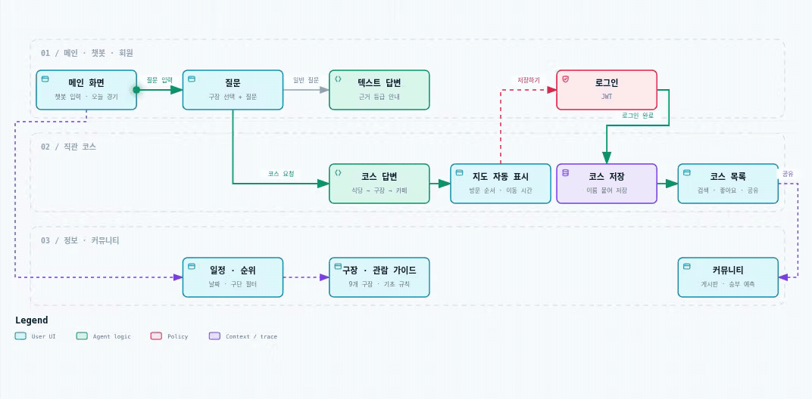</a></p>

<sub>▶ 선을 따라 흐름이 움직입니다 · 🔍 <b>그림을 누르면 크게 볼 수 있어요</b> (새 탭에서 크게 열림 · Ctrl + 휠로 더 확대) · 단계별 설명이 되는 <a href="./docs/architecture/ux_flow.html">인터랙티브 HTML</a> (내려받아 브라우저로 열기)</sub>

| 화면 | 설명 | 캡처 |
| --- | --- | --- |
| 메인 (`/`) | 챗봇 질문, 당일 경기 · 선발 투수, 팀 순위, 샘플 코스 | [TODO] |
| 챗봇 (`/chat`) | 구장 선택 후 질문, 답변 실시간 표시, 도구 진행 로그(✓ 완료 · ! 실패), 코스 답변 시 지도 자동 표시, 대화 목록 · 삭제 | [TODO] |
| 직관 코스 (`/routes`, `/routes/[id]`, `/routes/new`) | 코스 목록 · 상세(지도 · 방문 순서) · 직접 만들기(반경 2.5km 장소 탐색, 되돌리기 · 다시하기), 12단계 루트 만들기 가이드, 출발지 기준 챗봇 코스 자동 완성 · 다시 짜기 | [TODO] |
| 구장 정보 (`/stadiums`, `/guide`) | 9개 구장 위치 안내, 기초 규칙 · 관람 체크리스트 | [TODO] |
| 커뮤니티 (`/community`) | 자유 · 구단별 게시판, 승부 예측 | [TODO] |

---

## 14. API 문서

| 앱 | 역할 | API 명세서 |
| --- | --- | --- |
| `accounts` | 회원가입·로그인, JWT 인증과 회원 관리 | [회원·인증 API](./docs/api/accounts.md) |
| `llm` | 회원 채팅(게스트 엔드포인트도 로그인 필요), RAG 답변과 대화 기록 관리 | [채팅·RAG API](./docs/api/llm.md) |
| `baseball` | 구단·구장·경기·순위·티켓 등 야구 데이터 관리 | [야구 데이터 API](./docs/api/baseball.md) |
| `travel` | 직관 코스·장소·길찾기·날씨·관광 정보 제공 | [코스·장소 API](./docs/api/travel.md) |
| `community` | 게시글·댓글·이미지·승부 예측 기능 제공 | [커뮤니티 API](./docs/api/community.md) |
| `tving` | TVING 경기·구단·선수 데이터 수집과 조회 | [TVING 데이터 API](./docs/api/tving.md) |

---

## 15. 배포 (AWS · Docker · Nginx · CI/CD)

<p align="center"><a href="https://raw.githubusercontent.com/SKNETWORKS-FAMILY-AICAMP/SKN34-3rd-5Team/develop/docs/images/deploy_cicd.svg"></a></p>

<sub>▶ 선을 따라 흐름이 움직입니다 · 🔍 <b>그림을 누르면 크게 볼 수 있어요</b> (새 탭에서 크게 열림 · Ctrl + 휠로 더 확대) · 단계별 설명이 되는 <a href="./docs/architecture/deploy_cicd.html">인터랙티브 HTML</a> (내려받아 브라우저로 열기)</sub>

- **CI** — develop 대상 PR · push마다 Django `manage.py check` + Next.js `build`
- **CD** — develop push 시 `appleboy/ssh-action`으로 EC2에 접속해 재빌드 (비밀값은 GitHub Secrets `EC2_HOST` · `EC2_USER` · `EC2_SSH_KEY`)
- **컨테이너 시작 순서** — db · minio(healthcheck) → backend(`migrate` → 읽기 전용 계정 준비 → 서버) → frontend → nginx
- **볼륨** — `postgres_data` · `minio_data`, `data/` · `docs/`는 인덱싱용으로 읽기 전용 마운트

---

## 16. 테스트 계획 및 결과

> 🔴 필수 산출물 · 코드: [`rag_test/`](./rag_test/) · 상세: [`docs/deliverables/04_테스트계획_결과보고서.md`](./docs/deliverables/04_테스트계획_결과보고서.md) · 원본 결과: [`docs/test_results/`](./docs/test_results/)

### 16.1 테스트 계획

| 구분 | 대상 | 방법 | 지표 |
| --- | --- | --- | --- |
| 검색 성능 | pgvector 검색 + 필터 + 재정렬 | 골든셋 · 설정을 하나씩 추가(R0 → R4) | Hit@1 · Hit@3 · Hit@5 · MRR |
| 생성 성능 | RAG 체인 답변 | 골든셋 · 규칙 기반 채점 · 숫자 원문 대조 | 정답률 · 환각(지어냄) · 오거절 |
| 단위 · 통합 테스트 | 프롬프트 · 파서 · 도구 · SQL 검증기 · 대체 경로 · 인증 | unittest · Django test · node --test | 통과 여부 |
| 사용자 시나리오 | 로컬 서버 · 채팅 화면 | 수동 QA | 기대 결과 일치 · 응답 시간 |

### 16.2 골든셋 구성

- **club 55문항** — 반입 8 · 거절 8 · 규칙 6 · 일정 5 · 복합 5 · 가격 4 · 함정 4 · 순위 3 · 예매 3 · 좌석 2 · 재입장 2 · 별칭 2 · 모호 2 · 한계 1
- **venue 30문항** — club 위임 6 · 교통 5 · 구장 안 먹거리 5 · 모호 3 · 외부 먹거리 3 · 콘텐츠 3 · 긴 질문 3 · 편의시설 1 · 거절 1
- 문항마다 `expect`(answer · refuse · clarify · correct), 정답 `doc_id`, 필수 표현 `must`, 근거 등급을 기록
- 별칭("기아", "라팍") · 긴 구어체 질문 · **데이터에 없는 질문**(타율 1위, 오늘 선발, 응원가, 2027 개막일) · **틀린 전제**("삼성 3위 맞지?")를 일부러 포함

### 16.3 검색 성능 결과

정답 문서가 있는 45문항 기준 (거절 · 되묻기 10문항 제외), `ef_search=200`, 2026-09-14

| 설정 | Hit@1 | Hit@5 | MRR |
| --- | ---: | ---: | ---: |
| R0 벡터 검색만 | 42.2% | 51.1% | 0.452 |
| R1 + 구장 필터 | 40.0% | 55.6% | 0.456 |
| R2 + 카테고리 필터 | 64.4% | 86.7% | 0.719 |
| R3 + 키워드 재정렬 | 73.3% | 93.3% | 0.814 |
| **R4 + 날짜 가산 (최종)** | **75.6%** | **95.6%** | **0.836** |

➡️ 임베딩 모델을 바꾸지 않고 **메타데이터 필터와 키워드 재정렬만으로 Hit@5 51.1% → 95.6%**. 가장 큰 효과는 카테고리 필터(+31.1%p), 검색 시간은 모든 설정에서 5 ms 안팎입니다.

### 16.4 생성 성능 결과

club 55문항, `rag_test` 체인, 2026-09-14

| 모드 | 정답 | 오답 | 지어냄 | 오거절 |
| --- | ---: | ---: | ---: | ---: |
| answer (41) | 38 | 1 | 0 | 2 |
| refuse (8) | 7 | 0 | 1 | 0 |
| clarify (2) | 2 | 0 | 0 | 0 |
| correct · 함정 (4) | 4 | 0 | 0 | 0 |
| **합계 (55)** | **51 (92.7%)** | **1** | **1** | **2** |

| 실패 | 원인 | 대응 |
| --- | --- | --- |
| 사직 1루 내야상단석 가격 (오거절) | 구단 좌석명이 색상형 등급으로 나뉘어 LLM이 "없다"고 판단 | `get_ticket_prices(zone_keyword)`로 DB에서 구역명 직접 검색 |
| 두산 다음 홈경기 (오답) | "다음"을 데이터 기준일로 계산 | 프롬프트에 오늘 날짜 주입 + `get_games(status="upcoming")` |
| 포항 구장 주차 (지어냄) | 거절 답변에 확인되지 않은 제안을 덧붙임 | 포항 예외 문구를 고정 문장으로 |
| 홈팀 + 소주 반입 복합 (오거절) | 공통 주류 규정을 소주에 적용하지 못함 | 반입 규정 문장에 주종 예시 보강 예정 |

### 16.5 테스트 시나리오 (Test Case)

| No | 시나리오 | 입력 | 기대 결과 | 결과 |
| --- | --- | --- | --- | --- |
| TC-01 | 경기 수 조회 | 오늘 이후 KIA 홈경기 몇 경기 남았어? | `get_games`로 남은 경기 수 + 목록 | ✅ 7경기 (CSV 직접 계산과 일치) |
| TC-02 | 구장 주차 | 잠실 주차 얼마야? | 요금 · 면수를 문서 근거로 | ✅ 5분 200원(소형), 15분 미만 무료, 약 680면 · 첫 글자 4.3초 · 전체 5.1초 |
| TC-03 | 코스 추천 · 지도 표시 | 친구랑 잠실 경기 전후 걸어서 코스 짜줘 | 식당 → 구장 → 카페 + 지도 자동 표시 | ✅ 도보 1.2km, 지도 · 저장 동작 · 첫 글자 16.1초 · 전체 17.5초 |
| TC-04 | 비공식 정보 경고 | 사직야구장 나갔다가 다시 들어올 수 있어? | 답변 + 현장 확인 안내 | ✅ |
| TC-05 | 자료 없는 질문 거절 | KBO 타율 1위 선수 누구야? | 없다고 밝히고 확인처 안내 | ✅ |
| TC-06 | 야구와 무관한 질문 | 파이썬 숙제 좀 도와줘 | 범위 밖 안내 (LLM 0회) | ✅ dispatcher 규칙으로 차단 |
| TC-07 | 순위 조회 | 지금 KBO 순위 알려줘 | 최신 기준일 1~10위 | ✅ 첫 글자 6.8초 · 전체 8.8초 |
| TC-08 | 주변 장소 | 잠실 근처 숙소 추천 | 카카오 기준 가까운 순 | ✅ 도보 8~9분 숙소 · 첫 글자 8.5초 · 전체 11.1초 |
| TC-09 | 모호한 질문 | 재입장 되나요? | 어느 구장인지 되묻기 | ✅ |
| TC-10 | 틀린 전제 | 삼성 라이온즈 3위 맞지? | 실제 순위로 바로잡기 | ✅ "2위예요" |
| TC-11 | 별칭 | 기아 몇 위야? | 기아 → KIA 인식 | ✅ |
| TC-12 | 취소 · 환불 | 예매한 티켓 환불하려면 어떻게 해? | 예매처 문의 고정 안내 | ✅ |
| TC-13 | 야구 단어가 섞인 무관 질문 | 야구 좋아하는데 코딩 알려줘 | 범위 밖 안내 (LLM 0회) | ✅ dispatcher 규칙 + 단위 테스트 |

> TC-01은 2026-09-15 로컬 서버에서, TC-02 · 03 · 07 · 08의 시간은 2026-09-16 스트리밍 파이프라인 재측정([7.5](#75-rag-성능-원칙--느리면-인덱싱과-런타임부터)) 기준이며, TC-04 · 05 · 09 ~ 12는 2026-09-14 골든셋 평가에서 확인한 결과입니다. TC-06 · 13은 dispatcher 규칙(무관 주제 단어 + 야구 단어 없음, 또는 항상 차단하는 주제)을 코드와 단위 테스트로 확인한 결과입니다.

**단위 테스트**

```bash
cd backend
python manage.py test llm.rag.assistant.test_assistant   # 28건: 프롬프트 · 파서 · 도구 · SQL 검증 · 스트리밍 · 실패 대체 · 범위 차단
python manage.py test llm.test_progress                  # 19건: 진행 이벤트 · 민감값 제거 · 저장 · 중단 처리
python manage.py test llm.test_rag_domain_bindings       # 18건: 에이전트별 도구 28개 연결
python -m unittest llm.rag.nearby.test_nearby         # 8건
python -m unittest llm.rag.course.test_transport      # 12건
python manage.py test llm.test_course_chain              # 13건: 출발지 기준 단계별 코스 · 산책 단계 · 접두어 분리 · 국외 좌표 무시
python manage.py test baseball.tests.test_query_service
```

---

## 17. 시연 화면

| 기능 | 시연 |
| --- | --- |
| 챗봇 Q&A (주차 · 반입) | 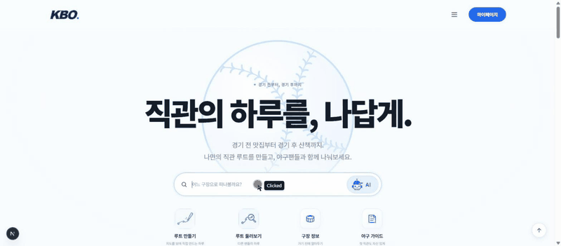 |
| 코스 추천 → 지도 자동 표시 | 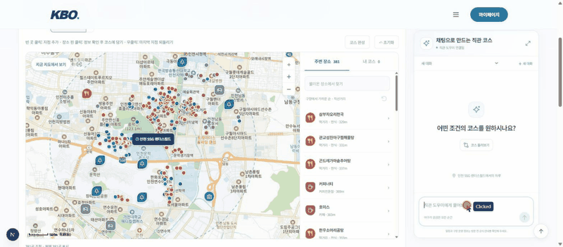 |
| 커뮤니티 · 코스 공유 | 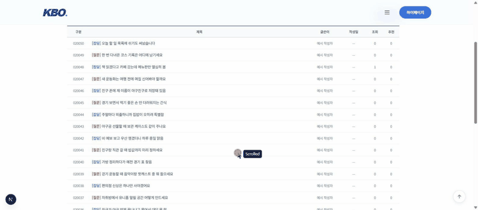 |
| 루트 만들기 가이드 | 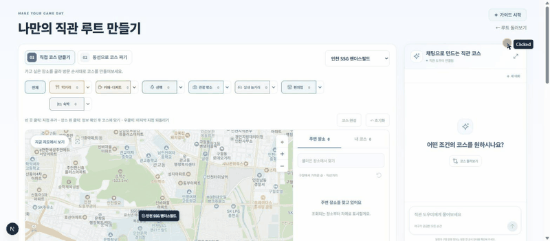 |

---

## 18. 트러블 슈팅

### 18.1 RAG · 데이터

<details>
<summary><b>① 출처 ID를 문서 ID로 썼더니 문서가 덮어써짐</b></summary>

- **문제**: `doc_id = source_id`로 적재하려 했는데 파일 간 충돌이 20건 나옴 (`S037`이 좌석구역 · 좌석도 · 가격 세 파일에 동시에 존재)
- **원인**: `source_id`는 "어느 공식 페이지에서 왔는지"를 뜻하는 **출처 ID**였고, 행을 구분하는 값이 아니었음
- **해결**: `doc_id = {CATEGORY}_{SCOPE}_{자연키}`로 바꾸고, 자연키가 겹치는 17행은 `_2`, `_3` 접미사 부여. 해시 대신 읽을 수 있는 ID라 골든셋 작성 · 로그 확인이 쉬워짐
- **결과**: `build_index`의 doc_id 중복 검사 0건

</details>

### 18.2 LangChain 파이프라인


<details>
<summary><b>② RAG와 야구 DB 조회를 한 질문에서 같이 쓰지 못함</b></summary>

- **문제**: "내일 잠실 몇 시고 주차는?"처럼 경기 정보와 구장 안내를 함께 묻는 질문에 한쪽만 답함
- **원인**: 채팅이 `CHAT_USE_RAG` 스위치 하나로 **RAG 체인 또는 SQL 도구 루프 중 하나만** 실행했고, 일정 · 순위가 RAG 청크(CSV 임베딩 시점)와 DB 두 곳에 있어 답이 달라질 수 있었음
- **해결**: 스위치를 없애고 `retrieve | build_prompt | agent | parse_output` **단일 파이프라인**으로 통일. 문서는 먼저 검색해 프롬프트에 넣고, DB는 읽기 전용 조회 도구로 필요할 때만 부름. 일정 · 순위 · 가격은 DB를 정본으로 정하고 해당 청크는 검색에서 제외
- **결과**: "오늘 이후 KIA 홈경기 몇 경기?" → `get_games`로 7경기 (CSV 직접 계산과 일치), 구장 안내 질문은 같은 경로에서 RAG로 답함

</details>

<details>
<summary><b>③ 에이전트가 도구만 부르고 답 없이 끝남</b></summary>

- **문제**: 에이전트가 답 없이 끝나면 빈 답변이 그대로 나갈 수 있음
- **원인**: `create_agent`의 마지막 메시지가 본문 없는 **도구 호출 메시지**로 끝나는 경우가 있음
- **해결**: `parse_output`이 도구 호출이 없는 마지막 AI 메시지만 읽고, 비어 있으면 예외를 내서 dispatcher가 기존 도메인(course · nearby · venue · club)으로 다시 답하게 함. `route`에 `agent:error>`를 남겨 추적
- **결과**: 사용자에게 빈 답이 나가지 않고, 로그에서 대체 경로를 탄 질문을 바로 찾을 수 있음

</details>

<details>
<summary><b>④ 코스 답변 글과 지도에 그린 코스가 어긋날 수 있음</b></summary>

- **문제**: 에이전트가 `plan_course` 결과를 다시 요약하면 장소 이름 · 순서가 지도 카드와 달라질 수 있음
- **원인**: LLM이 도구 결과를 자기 말로 다시 쓰는 구조
- **해결**: 코스 도구를 쓴 요청은 **코스 도메인이 만든 문구를 그대로 답변으로 사용**하고, `places` · `coursePayload`를 함께 내려 지도에 바로 그림. LLM은 장소 키 · 이유만 고르고 이름 · 좌표 · 거리는 DB 값과 코드 계산으로 채움
- **결과**: 답변 글과 지도 카드가 같은 데이터에서 나와 좌표 환각 0

</details>

<details>
<summary><b>⑤ 도메인 에이전트마다 쓸 수 있는 도구가 달랐음</b></summary>

- **문제**: 대체 경로로 간 질문(코스 · 구장 · 주변)은 일정 · 날씨처럼 다른 도메인 도구가 필요해도 부를 수 없었음
- **원인**: 도메인별로 도구 목록을 따로 붙임
- **해결**: `domain_tools.tools_for()`로 **모든 답변 에이전트에 같은 도구 28개**를 연결(이름이 같으면 assistant 전용 구현 우선). 코스를 만드는 중에는 `plan_course`를 다시 부르지 못하게 막아 재귀 방지. 요청별 도구 상태는 `request_state()`로 열고 끝나면 이전 상태로 복원
- **결과**: 어느 경로로 가도 같은 도구를 씀. `test_rag_domain_bindings`가 6개 경로(assistant · club · venue · course · nearby · chat)의 도구 목록이 같은지 검사

</details>

<details>
<summary><b>⑥ 답변이 다 만들어진 뒤에야 글자가 보임</b></summary>

- **문제**: 에이전트가 도구를 부르는 3 ~ 7초 동안 화면에 아무 변화가 없음
- **원인**: RAG 답을 완성한 뒤 24자씩 잘라 흘리는 **흉내 스트리밍**이었음
- **해결**: `stream_answer`에서 **도구 계획 단계와 최종 답변을 분리**. 계획 단계 출력은 화면에 보내지 않고(`PLANNER_RULE`), 최종 답변만 모델 토큰이 오는 대로 SSE `delta`로 보냄. 도구 시작 · 완료는 LangChain 콜백으로 모아 `progress` 이벤트로 표시하고 회원 대화는 DB에 저장
- **결과**: 조회 중에는 "경기 일정 조회 중 → 완료"가 보이고, 답변은 만들어지는 즉시 표시됨

</details>

<details>
<summary><b>⑦ 야구 단어가 섞인 무관한 질문이 차단을 빠져나감</b></summary>

- **문제**: "야구 좋아하는데 코딩 알려줘"가 에이전트 LLM까지 전달됨
- **원인**: 범위 판단이 "무관 주제 단어가 있고 **야구 단어가 없을 때만**" 차단하는 규칙이었음
- **해결**: 직관 준비와 접점이 없는 주제(코딩 · 숙제 · 주식 · 코인 · 부동산 · 로또 · 자동차 구매)는 야구 단어가 섞여도 차단하는 `HARD_OFF` 규칙을 먼저 검사
- **결과**: LLM 호출 없이 고정 안내, 단위 테스트 추가 (README TC-13)

</details>

### 18.3 배포


<details>
<summary><b>⑧ Django <code>ALLOWED_HOSTS</code> 설정 누락으로 EC2 배포 환경에서 HTTP 요청 거부</b></summary>

- **문제**: EC2 배포 후 외부에서 서비스에 접근하면 Django가 요청을 거부함
- **원인**: `ALLOWED_HOSTS`에 로컬 주소(`localhost`, `127.0.0.1`, `[::1]`)만 등록되어 있고 EC2 접근 주소가 없었음. Nginx가 `Host` 헤더를 그대로 넘기기 때문에 Django가 EC2 주소를 허용되지 않은 호스트로 판단
- **해결**: 배포 환경의 EC2 주소를 `ALLOWED_HOSTS`에 추가. `docker-compose.yml`에서 `DJANGO_ALLOWED_HOSTS` 환경변수로 넘기고, `*`(전체 허용)는 설정 단계에서 막음
- **결과**: EC2 → Nginx → Django 요청 정상 처리

</details>

---

## 19. 향후 개선 계획 · 비즈니스 전략

### 19.1 모델 · 서비스 고도화
- **장소 인기 신호 추가**: 지금은 평점·리뷰 데이터가 없어 거리·동선·조건으로만 고릅니다. 우리 사이트 코스에 많이 담긴 장소 가중치, 공공 관광 데이터, 사용자 별점을 붙여 "실제로 많이 가는 곳"을 반영할 계획입니다.
- **주점·야간 장소 수집 보강**: 카카오 API의 카테고리당 45건 제한 때문에 주점이 9개 구장 합계 11곳뿐입니다. 키워드 검색으로 따로 수집합니다.
- **진짜 증분 인덱싱**: `doc_id + content_hash`로 바뀐 행만 다시 임베딩하고 upsert (지금은 임베딩만 재사용하고 테이블은 전체 교체)
- **경기 결과 · 순위 자동 갱신**: 수집 스크립트 → DB upsert 스케줄러
- **평가 자동화**: 에이전트 파이프라인으로 골든셋 전체 재평가, PR마다 골든셋 회귀 실행
- **첫 글자 시간 단축**: 도구가 필요 없는 문서 질문은 도구 계획 단계를 건너뛰고 바로 답변 스트리밍, `reasoning_effort` 하향 검토, 코스는 `plan_course` 내부 LLM 호출을 계획 단계와 합치기 (지금 첫 글자 중앙값 6.8초)
- **야구 뉴스**: 구단 · KBO 소식을 모아 제목 · 링크 · 요약으로 보여 주고, 챗봇이 최신 소식을 근거로 답변
- **GPT 플러그인 인터페이스**: 구장 안내 · 경기 조회 · 코스 추천 도구를 GPT 같은 외부 AI 서비스에서도 부를 수 있는 플러그인 형태로 제공
- **야구 규정집 확대 (전체)**: 지금은 기초 규칙 요약본만 인덱싱 → 공식 야구 규칙 · KBO 리그 규정 전체로 넓혀 세부 규칙 질문까지 답변
- **야구 사건 · 사고 정보**: 경기 중 사건, 구장 안전사고, 징계 · 판정 이슈를 공식 발표 기준으로 정리해 안내
- **승부 예측 고도화**: 지금의 커뮤니티 투표형 예측에 전력 · 최근 성적 · 상대 전적 데이터를 활용한 AI 예측과 적중률 공개를 더함
- **커뮤니티 개선**: 게시글 검색 · 인기글 · 댓글 알림 · 신고 · 차단 등 이용 · 운영 기능 보강
- **링크 바로 이동**: 챗봇 답변의 링크를 누르면 NOL 티켓 같은 예매처나 우리 홈페이지(일정 · 구장 · 코스 작성)로 바로 이동

### 19.2 실제 서비스 적용 시 추가 기능
- 🎫 **예매 오픈 알림** — 응원 팀 예매 오픈 시각에 푸시
- 📓 **직관 기록 · 승률 트래커** — "내가 간 경기"를 기록하고 저장한 코스와 연결
- 🌧️ **우천 · 날씨 기반 코스 변경** — 기상청 데이터로 실내 코스 제안
- 🧑‍🤝‍🧑 **원정 팬 가이드** — 원정석 위치 · 동선 · 원정 팬이 많이 찾는 식당
- 📱 **모바일 앱** — 구장 안에서 쓰기 좋은 형태
- 📸 **치어리더 짤 · 직캠 공유 게시판** — 치어리더 짤과 직캠을 올리고 공유하는 게시판을 추가해 커뮤니티 활성화와 체류 시간을 높이고, 검색 · 외부 링크를 통한 신규 유입을 확보

### 19.3 적용 가능한 곳 · 비즈니스 모델 · 수익화

| 단계 | 내용 |
| --- | --- |
| ① 업체 입점 | **야구용품 업체 입점 페이지**를 제공해 업체가 상품을 홍보하고 판매할 수 있도록 구성 |
| ② 광고 수익 | **상단 노출, 인기 게시판 · 페이지 광고** 등 유료 광고 상품을 제공해 수익화 |
| ③ 구단 공식 입점 | 서비스가 성장하면 **특정 구단의 공식 입점**을 유도하고, 이를 기반으로 **다른 구단의 추가 입점**으로 확대 |
| ④ 함께 성장하는 구조 | 구단의 **굿즈 판매가 주요 수익원** 중 하나라는 점을 활용해 **구단 · 업체 · 플랫폼이 함께 성장**하는 구조 구축 |
| ⑤ 제휴 모델 | **구장 주변 식당 · 숙소 제휴 노출**, 코스 추천과 연계한 **할인 쿠폰** 제공 |

> **성장 흐름**: 야구용품 업체 입점 → 유료 광고(상단 노출 · 인기 게시판) → 특정 구단 공식 입점 → 다른 구단 추가 입점 → 굿즈 판매 연계로 구단 · 업체 · 플랫폼 동반 성장

---

## 20. 협업 방식

- **Git 전략**: Fork → `feat/*` 브랜치 → 팀 저장소 `develop` PR → 팀장 리뷰 · Approve 후 Squash merge (작성자 임의 병합 금지, 공용 `main`/`develop` 직접 Push 금지)
- **커밋 규칙**: `type: 한글 작업 내용` (`feat` · `fix` · `refactor` · `docs` · `test` · `chore`)
- **코드 소유**: `llm/rag/club` · `course`는 임형준, `venue`는 이현준 — 상대 폴더는 PR 리뷰로만 수정. 말투(`persona.py`)는 바꾸기 전에 팀 채널에 공유
- **계약 관리**: DRF serializer → OpenAPI(`contracts/openapi.yaml`) → 프론트 TypeScript 타입 자동 생성, `contracts:check`로 검사
- **도구**: GitHub · Notion · Postman · [TODO] 메신저
- **협업 중 문제와 해결**:

| 문제 | 해결 |
| --- | --- |
| 개인 브랜치마다 파이프라인 구조가 달라 병합 방향이 헷갈림 | 09/16 **팀 develop 최신본을 최종본으로 통일**, 개인 브랜치 별도 반영 안 함 |
| 두 명이 같은 RAG 파일을 동시에 수정 | 도메인 폴더 분리 + `answer()` 입출력 약속만 공유 |
| 프론트 · 백엔드 응답 형식 불일치 | OpenAPI 계약 자동 생성 · 검사 |
| 평가 결과 CSV가 git에 안 올라감 (`rag_test/results/` 제외) | 최종 결과만 `docs/test_results/`로 복사 |
| develop pull 후 환경변수 · 프론트 캐시 문제 | 루트 `.env` 필수 값 정리, `--renew-anon-volumes`로 재빌드 |

---

## 21. 한 줄 회고

| 이름 | 회고 |
| --- | --- |
| 윤성호 | 이번 협업을 통해 처음으로 Django를 활용하며 Python 기반 웹 백엔드 구조를 익혔고, JWT 인증과 챗봇 API·SSE 스트리밍 연동을 구현하면서 실제 서비스의 요청 흐름을 경험할 수 있었습니다. <br/> GitHub Actions를 통한 자동 빌드·배포 과정을 접하며 협업부터 테스트·배포까지 전체 개발 흐름을 이해하는 데 많은 도움이 되었습니다. |
| 임형준 | 이번 프로젝트에서 LLM 파이프라인, Docker, Git Flow를 처음 제대로 써 봤습니다. RAG와 에이전트 도구를 붙이고, 컨테이너로 묶고, Fork·PR로 협업하는 것까지 배울 게 많아서 힘든 점이 있었습니다.<br/>그래도 막힐 때마다 팀원들이 바로 도와주고, 각자 맡은 기능을 잘 구현해 준 덕분에 정해진 기한 안에 마무리할 수 있었습니다.<br/>4차에서는 응답 속도와 데이터 갱신 같은 고도화, 그리고 마무리까지 더 잘 해내겠습니다. |
| 이현준 | 처음 도커와 Ci/CD 환경을 구축 했습니다. 구축 자체는 쉬운데 각 설정하는 부분이 좀 어려웠습니다. 그래서 실무 기준으로 설정을 찾고 다시 우리 환경에 맞게 변경하여 설정을 했습니다. RAG 부분도 실습 때 와는 다르게 신경 쓸게 많다보니 좀 효율적으로 개발을 하지 못했습니다. 4차 때는 효율부분을 신경써서 다시 최대한 안 복잡하게 리펙토링을 할 생각입니다. |
| 최인영 | 프론트 기능 구현이나 커뮤니티 사이트는 솔직히 만들기 수월할 줄 알았는데, 생각보다 꼬이는 것도 많고 항상 문제가 생기는 영역이라는 것을 깨달았습니다.<br/>4차 고도화 때는 최대한 많은 오류와 변수를 제거하고, 보다 나은 직관성과 유입을 위한 콘텐츠를 제공할 예정입니다. |
| 김진화 | 데이터베이스/ERD 작성 파트를 처음 맡아 봐서 우여곡절이 많았는데, 팀원들이 원하는 요구사항을 정확히 이야기해 줘서 훨씬 수월하게 진행했던 것 같습니다. 협업 시스템도, 여기 들어가기 전에는 거의 혼자 하거나, 아예 연동이 거의 안 되는 시스템을 별도로 하나씩 만든 다음 호환성을 담당하는 사람이 진행하는 구조여서 잘 못했던 걸, 친절한 사람들과 배워가면서 한 게 참 좋았던 것 같습니다. |

---

<!-- 참고 자료 링크 -->
[mt]: https://www.mt.co.kr/sports/2026/09/13/2026091215014823882
[jb]: https://www.jungbunews.com/news/articleView.html?idxno=2724260
[hk]: https://www.hankyung.com/article/2025090560771
[fan]: https://www.dailybizon.com/news/articleView.html?idxno=61642
[md]: https://v.daum.net/v/20251206090114369
[et]: https://www.etoday.co.kr/news/view/2512560
[wt]: https://www.wikitree.co.kr/articles/1133450
