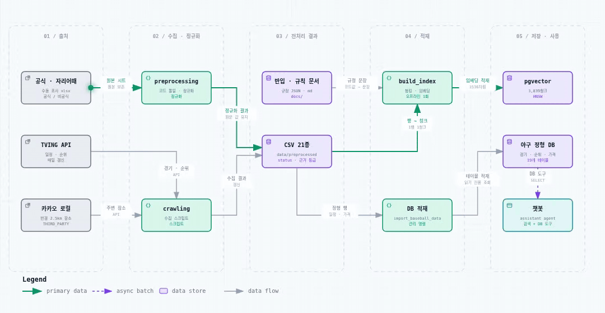

# 📦 산출물 1. 수집된 데이터 및 데이터 전처리 문서

> KBO 직관 안내 챗봇 · SKN34 3차 5팀 · 기준일 2026-09-16 (develop)
> 관련 폴더: `data/raw/`, `data/preprocessed/`, `backend/crawling/`, `backend/preprocessing/`, `docs/`

---

## 1. 수집 원칙

| 원칙 | 내용 |
| --- | --- |
| **robots.txt 준수** | KBO 공식 홈페이지(koreabaseball.com)는 자동 수집 대상에서 제외. 일정·순위는 TVING API, 예매정책은 yagu.today(robots 허용)로 대체 |
| **공식 우선, 비공식은 표시** | 구단·지자체 공지를 1순위로 쓰고, 블로그·위키·앱 데이터는 `evidence_type`으로 구분해 함께 보관 |
| **원본 보존** | 팀원이 조사한 xlsx·원본 CSV는 `data/raw/`에 두고 어떤 스크립트도 덮어쓰지 않음 |
| **재현 가능** | 수집·전처리 결과는 전부 스크립트로 다시 만들 수 있게 `data/preprocessed/`에 저장 |
| **저작권 제외 항목** | 응원가 가사, 선수 개인 기록 TOP5는 수집 범위에서 제외 |

---

## 2. 수집 데이터 목록 (`data/preprocessed/`, 21종)

| 파일 | 행 | 출처 | 수집 방법 | 주요 컬럼 | 신뢰도 |
| --- | ---: | --- | --- | --- | --- |
| `kbo_schedule_full.csv` | 782 | TVING API | 스크립트 `crawling/kbo_schedule.py` | 날짜·시각·홈/원정·구장·점수 | THIRD_PARTY_API |
| `kbo_schedule_postseason_tbd.csv` | 4 | 파생 | `kbo_schedule_postseason_placeholder.py` | 참가팀 미정 일정 | DERIVED (인덱싱 제외) |
| `kbo_standing.csv` | 10 | TVING API | 스크립트 `crawling/kbo_standing.py` (실행마다 덮어씀) | 순위·승·패·게임차 | THIRD_PARTY_API |
| `kbo_standing_history.csv` | 10 | TVING API | 같은 스크립트, 날짜별 누적 | 기준일·순위 | THIRD_PARTY_API |
| `kbo_ticket_policy_structured.csv` | 244 | yagu.today | 크롤링 → `parse_ticket_policy.py`로 문장 → 구조화 | 예매 오픈·매수 제한·예매처 | THIRD_PARTY_API |
| `구장티켓가격.csv` | 740 | 10개 구단 공식 | 팀원 조사 xlsx → `normalize_ticket_prices.py` | 구역·요일·대상·가격 | OFFICIAL |
| `구장좌석구역.csv` | 192 | 구단 공식 | `normalize_seat_zones.py` | 구역 코드·이름·층·방향 | OFFICIAL |
| `구장좌석경험.csv` | 8 | 구단 공식 | `normalize_official_extras.py` | 구장·그룹 단위 시야 설명 | OFFICIAL |
| `구장좌석도.csv` | 10 | 구단 공식 | `normalize_official_extras.py` | 좌석도 페이지·이미지 URL | OFFICIAL |
| `구장운영정보.csv` | 9 | 구단 공식 | `normalize_official_extras.py` | 운영 주체·대표 전화 | OFFICIAL |
| `구장교통정보.csv` | 43 | 구단·지자체 + 보완 조사 | `normalize_transport.py` | 지하철·버스·주차·셔틀 | OFFICIAL 40 · UNOFFICIAL 3 |
| `구장잔여정보_좌석주차버스.csv` | 14 | 팀원 보완 조사 | `normalize_new_supplements.py` | 좌석도·주차 수용면·정류장 | 혼합 |
| `구장편의시설.csv` | 207 | 구단 공식 지도·앱 | `normalize_new_supplements.py` | 화장실·수유실·흡연구역 등 | OFFICIAL 계열 |
| `구장편의시설_보류이력.csv` | 8 | 팀원 보완 조사 | 같은 스크립트 | 검증 보류 이력 | 인덱싱 제외 |
| `구장편의시설_위치_자리어때.csv` | 100 | 자리어때 | 정리 후 정규화 | 굿즈샵·포토부스·물품보관함 | UNOFFICIAL |
| `구장먹거리_공식매점.csv` | 291 | 구단 매점 안내 | `normalize_food_stores.py` | 매장명·위치·메뉴 | OFFICIAL (인덱싱 제외, 보존) |
| `구장먹거리_위치_자리어때.csv` | 385 | 자리어때 | 정리 후 정규화 | 구장 안 매장·층·구역 | UNOFFICIAL |
| `구장부가콘텐츠_공식.csv` | 68 | 구단 공식 | `normalize_food_stores.py` | 포토존·전시·체험 | OFFICIAL |
| `external_places.csv` | 1,008 | 카카오 로컬 API | `crawling/collect_kakao_places.py` (반경 2.5km) | 음식점 405 · 카페 405 · 명소 198 | THIRD_PARTY_API |
| `stadium_coordinates.csv` | 9 | 카카오 로컬 API | 같은 스크립트 | 구장 주소·좌표 | THIRD_PARTY_API |
| `3차_신규확보데이터.csv` | 14 | 팀원 3차 재검증 | `build_backlog_findings_ref.py` | 반영 여부 추적용 | 참조 (인덱싱 제외) |

**문서형 데이터 (`docs/`)**

| 파일 | 내용 | 활용 |
| --- | --- | --- |
| `KBO_반입물품_재입장규정.json` | 공통 반입 규정 + 10구단별 반입 5항목·재입장 13항목 + 챗봇 응답 규칙 | 인덱싱 21청크 |
| `기초규칙_요약본.md` | 이닝·아웃·볼카운트·ABS·피치클락 등 | 인덱싱 11청크 |
| `포항_특별경기_예외처리.md` | `stadium_code=OTHER` 3경기 처리 규칙 | 코드 분기 스펙 (인덱싱 X) |

---

## 3. 전처리 파이프라인

<p align="center"><a href="https://raw.githubusercontent.com/SKNETWORKS-FAMILY-AICAMP/SKN34-3rd-5Team/develop/docs/images/data_pipeline.svg"></a></p>

<sub>▶ 선을 따라 흐름이 움직입니다 · 🔍 <b>그림을 누르면 크게 볼 수 있어요</b> (새 탭에서 크게 열림 · Ctrl + 휠로 더 확대) · 단계별 설명이 되는 <a href="../architecture/data_pipeline.html">인터랙티브 HTML</a> (내려받아 브라우저로 열기)</sub>

### 3-1. 단계별 처리

| 단계 | 처리 | 예시 |
| --- | --- | --- |
| ① 코드 통일 | 구장·팀 표기를 표준 코드로 변환 (`team_stadium_code_map.csv` 기준) | `INCHEON_SSG` → `MUNHAK`, `DAEJEON_HANWHA` → `DAEJEON` |
| ② 스키마 정리 | 시트 컬럼을 snake_case로 옮기고, **값은 원본 그대로** (등급명 표준화 안 함) | 좌석 등급: 이름형/색상형/티어형을 그대로 유지 |
| ③ 문장 → 구조화 | 예매정책 자연어를 항목별 컬럼으로 파싱 | "오픈 7일 전 11시" → `open_days_before=7`, `open_time=11:00` |
| ④ 신뢰도 부여 | 행마다 `status`, `evidence_type`, 세부값 `evidence_subtype` | `OFFICIAL_GUIDE_MAP` → `OFFICIAL` + subtype 보존 |
| ⑤ 보완 조사 반영 | 오버레이 함수로 원본 위에 조사 결과 적용 | 대구 지하철역 "대공원역" → "수성알파시티역"(2024 고시) 정정 |
| ⑥ content 컬럼 | 행을 `[구장 · 팀] 항목: 값 / …` 한 줄로 요약 | 사람 검수·인덱싱 대조용 |

### 3-2. 품질 관리 규칙

| 항목 | 규칙 |
| --- | --- |
| `status` | `CONFIRMED`(확정) / `PARTIAL`(일부 확인) / `RECHECK`(재확인 필요) / `HISTORICAL_ONLY`(과거 기록) |
| `evidence_type` | `OFFICIAL` / `UNOFFICIAL` / `THIRD_PARTY_API` / `DERIVED` |
| 결측 | "해당 없음"과 "모름"을 구분. 예: 좌석구역 `level` 결측은 원본에 층 개념이 없는 것 (정상) |
| 0원 | `price_krw=0` 4행은 오류가 아니라 무료 요금(엘린이·미취학 아동) → 할인 조건과 함께 안내 |
| 동적 가격 | NC 50행은 특정 경기 1건의 가격 스냅샷 → "경기별로 달라질 수 있음" 문구 필수 |
| 수치 충돌 | 대전·광주·대구 주차 수치가 두 파일에서 다르면 병합하지 않고 층위(전체 수용면 vs 경기일 운영 조건)를 구분해 둘 다 보존 |

### 3-3. 신뢰도 분포 (인덱싱 청크 3,839개 기준)

| evidence_type | 청크 | 비율 |
| --- | ---: | ---: |
| THIRD_PARTY_API (일정·예매정책·카카오) | 2,012 | 52.4% |
| OFFICIAL 계열 (공식 홈페이지·지도·앱) | 1,251 | 32.6% |
| UNOFFICIAL (자리어때·블로그·위키) | 498 | 13.0% |
| 기타·미지정 (현장 방문·사용자 제공 이미지 등) | 78 | 2.0% |

> 답변 시 `OFFICIAL`이 아니면 persona 규칙에 따라 "현장·구단 확인" 안내 문구가 붙습니다.

---

## 4. 인덱싱 대상 선정 (청킹 전 결정)

| 구분 | 파일 | 처리 |
| --- | --- | --- |
| 임베딩 O | 티켓가격, 좌석구역·경험·좌석도, 교통, 잔여정보, 편의시설(공식+자리어때), 자리어때 먹거리, 부가콘텐츠, 운영정보, 예매정책, 카카오 장소, 일정·순위, 구장 좌표, 반입·재입장 JSON, 기초규칙 | 3,839청크 |
| 임베딩 X | `구장먹거리_공식매점.csv` | 팀 결정(09-10, B안): 구장 안 먹거리는 자리어때로 통일. 파일은 4차 크롤링 소스로 보존 |
| 임베딩 X | `구장편의시설_보류이력.csv`, `3차_신규확보데이터.csv`, `kbo_schedule_postseason_tbd.csv` | 검증 보류·참조용·참가팀 미정 |
| 임베딩 O + DB 우선 | 일정·순위 | 검색에 포함하되, 답변은 DB 조회 도구 결과를 정본으로 사용 |

### 카테고리별 청크 수

| category | 청크 | 소스 |
| --- | ---: | --- |
| SCHEDULE | 782 | kbo_schedule_full |
| PRICE | 740 | 구장티켓가격 |
| CAFE | 401 | 카카오 CE7 |
| FOOD_OUT | 387 | 카카오 FD6 |
| FOOD_IN | 385 | 자리어때 먹거리 |
| FACILITY | 307 | 편의시설 207 + 자리어때 100 |
| TICKET_POLICY | 244 | 예매정책 |
| SEAT | 210 | 좌석구역 192 + 좌석도 10 + 좌석경험 8 |
| SPOT | 198 | 카카오 AT4 |
| CONTENT | 68 | 부가콘텐츠 |
| TRANSPORT | 57 | 교통 43 + 잔여정보 14 |
| CARRY_IN / REENTRY | 11 / 10 | 반입·재입장 JSON |
| RULE | 11 | 기초규칙 요약본 |
| STANDING / OPERATION / STADIUM | 10 / 9 / 9 | 순위·운영·좌표 |
| **합계** | **3,839** | |

> 카카오 장소는 1,008곳 중 좌표·분류가 맞는 986곳이 인덱싱됨.

---

## 5. 실행 방법

```bash
# 수집 (카카오는 루트 .env 의 KAKAO_REST_API_KEY 필요)
python backend/crawling/kbo_schedule.py
python backend/crawling/kbo_standing.py
python backend/crawling/collect_kakao_places.py

# 전처리
python backend/preprocessing/parse_ticket_policy.py
python backend/preprocessing/normalize_transport.py
python backend/preprocessing/normalize_ticket_prices.py
# ... (전체 목록: backend/preprocessing/README.md)

# 결과 확인
python backend/manage.py build_index --dry-run
```

> ✏️ **TODO(데이터 담당)**: 수집 일시·담당자, 원본 xlsx 조사 방법(현장 방문 여부 등)을 보강해 주세요.
