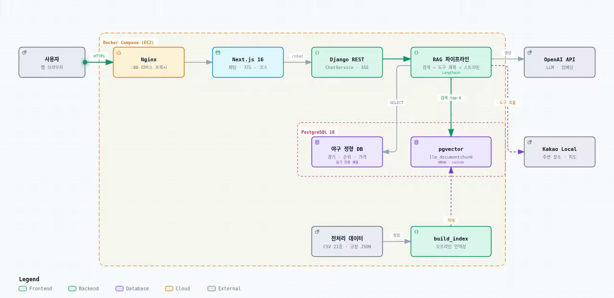
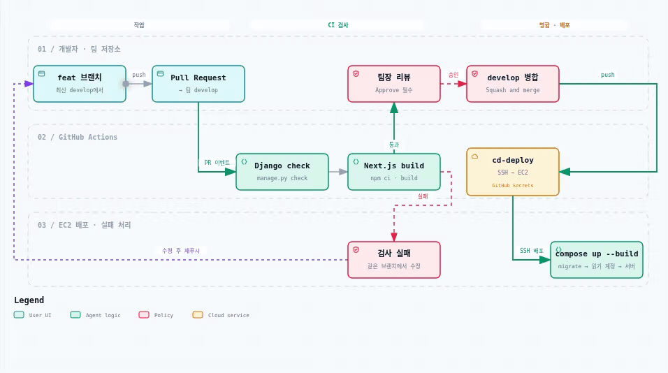
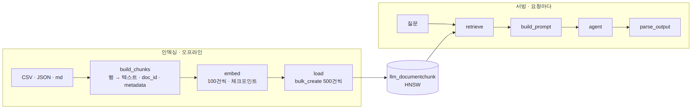
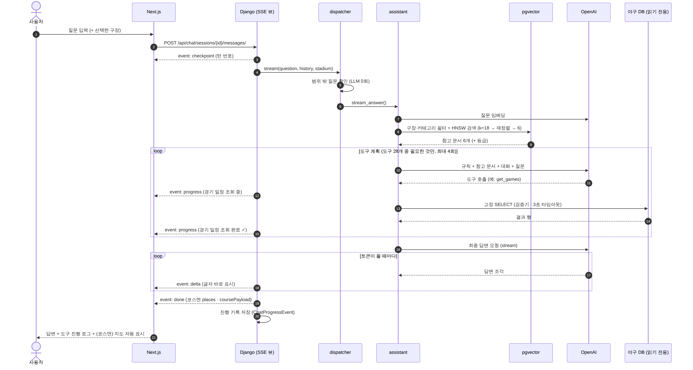
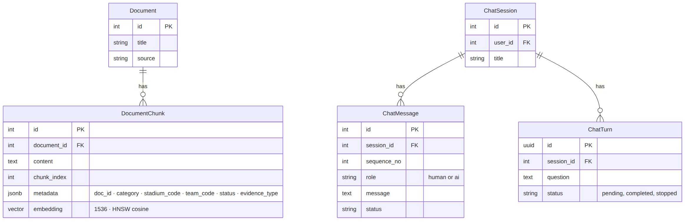

# 📦 산출물 2. 시스템 아키텍처

> KBO 직관 안내 챗봇 · SKN34 3차 5팀 · 기준일 2026-09-16 (develop)
> 다이어그램 목록: [`docs/architecture/README.md`](../architecture/README.md) · 원본 정의: [`system_architecture.archify.json`](../architecture/system_architecture.archify.json)

---

## 1. 전체 구조

<p align="center"><a href="https://raw.githubusercontent.com/SKNETWORKS-FAMILY-AICAMP/SKN34-3rd-5Team/develop/docs/images/system_architecture.svg"></a></p>

<sub>▶ 선을 따라 흐름이 움직입니다 · 🔍 <b>그림을 누르면 크게 볼 수 있어요</b> (새 탭에서 크게 열림 · Ctrl + 휠로 더 확대) · 단계별 설명이 되는 <a href="../architecture/system_architecture.html">인터랙티브 HTML</a> (내려받아 브라우저로 열기)</sub>


| 계층 | 구성 요소 | 기술 | 포트 |
| --- | --- | --- | --- |
| Client | 웹 화면 (채팅·지도·코스·일정·커뮤니티) | Next.js 16.3 · React 19.2 · TypeScript · Tailwind 4 · Kakao Map JS SDK | 3000 |
| Gateway | 리버스 프록시 | Nginx (`/` → frontend, `/api/` → backend) | 80 |
| API | REST API · 채팅 SSE | Django 6.1 · DRF 3.18 · SimpleJWT · drf-spectacular | 8000 |
| LLM | RAG 파이프라인 · 에이전트 | LangChain 1.x (`bind_tools` 도구 계획 + 토큰 스트리밍, 비스트리밍 경로는 `create_agent`) · langchain-openai | – |
| Vector DB | 문서 청크 + 임베딩 | PostgreSQL 18 + pgvector (HNSW, cosine, 1536차원) | 5432 |
| RDB | 야구 정형 데이터 19개 테이블 · 회원 · 채팅 · 코스 | PostgreSQL 18 (같은 인스턴스) | 5432 |
| Object Storage | 커뮤니티 이미지 | MinIO (private bucket) | 9000 |
| Mail | 비밀번호 재설정 메일 (로컬) | Mailpit | 1025 / 8025 |
| 외부 API | LLM·임베딩 / 장소·지도 / 관광 / 날씨 | OpenAI · Kakao Local · 한국관광공사 TourAPI · 기상청 | – |
| Ops | 컨테이너 · 배포 · 추적 | Docker Compose · GitHub Actions → EC2 · LangSmith | – |

---

## 2. 배포 구성 (Docker Compose)

> 컨테이너 구성은 위 [시스템 아키텍처](#1-전체-구조) 그림의 **Docker Compose (EC2)** 영역과 같습니다.

| 서비스 | 이미지 / 빌드 | 시작 순서 · 기동 명령 |
| --- | --- | --- |
| `db` | `pgvector/pgvector:pg18` | 먼저 시작, `postgres_data` 볼륨 |
| `minio` | `quay.io/minio/minio` | healthcheck 통과 후 backend 시작 |
| `backend` | `./backend` | `migrate` → `provision_baseball_reader`(읽기 전용 DB 계정 준비) → `runserver` |
| `frontend` | `./frontend` | backend 다음 |
| `nginx` | `nginx:alpine` | backend·frontend 다음 |
| `mailpit` | `axllent/mailpit` | 독립 |

- `data/`, `docs/`는 **읽기 전용**으로 마운트되어 `build_index`가 전처리 CSV·규정 JSON을 읽습니다.
- `docker compose`는 **루트 `.env`만** 읽습니다.

### CI/CD (`.github/workflows/deploy-dev.yml`)

<p align="center"><a href="https://raw.githubusercontent.com/SKNETWORKS-FAMILY-AICAMP/SKN34-3rd-5Team/develop/docs/images/deploy_cicd.svg"></a></p>

<sub>▶ 선을 따라 흐름이 움직입니다 · 🔍 <b>그림을 누르면 크게 볼 수 있어요</b> (새 탭에서 크게 열림 · Ctrl + 휠로 더 확대) · 단계별 설명이 되는 <a href="../architecture/deploy_cicd.html">인터랙티브 HTML</a> (내려받아 브라우저로 열기)</sub>

---

## 3. 두 개의 경로 — 인덱싱과 서빙

RAG 시스템의 핵심은 **무거운 일(인덱싱)과 가벼운 일(서빙)을 분리**하는 것입니다.

| | 인덱싱 경로 (오프라인) | 서빙 경로 (요청마다) |
| --- | --- | --- |
| 실행 시점 | 데이터가 바뀔 때 관리 명령으로 1회 | 사용자 질문마다 |
| 하는 일 | 파일 로딩 → 청크 텍스트 생성 → 임베딩 → pgvector 적재 | 질문 임베딩 → 검색 → 프롬프트 → 도구 계획 → 답변 토큰 스트리밍 |
| 코드 | `llm/management/commands/build_index.py` | `llm/views.py`(SSE) → `rag/pipeline.py` → `dispatcher.py` → `assistant/pipeline.py` |
| 비용 | 전량 약 100원 (임베딩) | 임베딩 1회 + LLM 2~6회 (도구 계획 1~5회 + 답변 1회) |
| 시간 | 수 분 | 검색 약 10 ms + 생성 수 초 |

<p align="center"></p>
<p align="center"><sub>🔍 그림을 누르면 원본 크기로 볼 수 있어요</sub></p>


---

## 4. 서빙 경로 상세

### 4-1. 요청 흐름 (시퀀스)

<p align="center"></p>
<p align="center"><sub>🔍 그림을 누르면 원본 크기로 볼 수 있어요</sub></p>

1. 뷰가 `checkpoint`를 먼저 보내고, 별도 스레드에서 체인을 실행해 이벤트를 큐로 받습니다.
2. dispatcher가 범위 밖 질문을 LLM 없이 거릅니다.
3. 검색 후 **도구 계획** 단계에서 도구를 최대 4회 부르고, 도구가 시작 · 완료될 때마다 `progress` 이벤트가 나갑니다.
4. 계획이 끝나면 **최종 답변만** 모델에서 토큰 단위로 받아 `delta`로 바로 보냅니다.
5. 끝나면 `done`(코스면 지도 좌표 포함)을 보내고, 회원 대화는 진행 기록을 `ChatProgressEvent`에 남깁니다.


### 4-2. 장애 대비

| 상황 | 동작 |
| --- | --- |
| 벡터 검색 실패 | 참고 문서 없이 계속 진행 ("검색 결과 없음") |
| 에이전트 예외 · 빈 답 | 답변 조각을 보내기 전이면 같은 질문을 기존 도메인(club · venue · course · nearby)으로 다시 답함, `route`에 `agent:error>` 기록. 이미 조각을 보냈으면 `error` 이벤트 |
| 브라우저 연결 끊김 | 다음 모델 · 도구 호출을 시작하지 않고 진행 기록을 `interrupted`로 남김 |
| 진행 기록 저장 실패 | 대체 경로로 삼키지 않고 요청을 실패 처리 (기록 누락 방지) |
| 도메인 하나가 실패 | course → venue → club 순으로 대체, 모두 실패하면 고정 오류 문구 (500 에러 없음) |
| 카카오 API 실패 | nearby → venue(RAG) 대체 |
| 테스트 실행 중 | RAG 체인을 끄고 기존 채팅 체인 사용 (회귀 테스트 보호) |

### 4-3. 보안 · 안전장치

| 항목 | 내용 |
| --- | --- |
| DB 접근 | 챗봇은 **별도 읽기 전용 계정**(`BASEBALL_DB_USER`)으로만 조회 |
| SQL 검증 | sqlglot 파싱 → SELECT 1문장만, 허용 테이블·함수만, 최대 200행·3초·응답 1MB |
| 자유 SQL | 에이전트는 스키마 조회 도구를 먼저 불러야 `execute_baseball_select` 사용 가능 |
| 범위 밖 질문 | 무관 주제 + 야구 단어 없음이면 차단, 코딩 · 숙제 · 주식 · 코인 · 자동차 구매 등은 야구 단어가 섞여도 차단 (LLM 0회) |
| 진행 기록 | 도구별 허용 키만 남기고 SQL · 스키마 · URL은 버림. 입력 · 결과는 관리자 계정에만 전송 |
| 인증 | JWT (access 5분 · refresh 1일, 로그아웃 시 blacklist) |
| 비밀값 | `.env`는 커밋 금지, `.env.example`만 공유 |
| 답변 | 근거 없는 수치 금지, 취소·환불은 예매처 안내 고정, 내부 용어(SQL·테이블명) 노출 금지 |

---

## 5. 데이터 모델

<p align="center"></p>
<p align="center"><sub>🔍 그림을 누르면 원본 크기로 볼 수 있어요</sub></p>


**`DocumentChunk.metadata` 예시**

```json
{
  "doc_id": "CARRY_IN_COMMON_COMMON",
  "category": "CARRY_IN",
  "stadium_code": null,
  "team_code": null,
  "status": "CONFIRMED",
  "evidence_type": "OFFICIAL",
  "source_file": "KBO_반입물품_재입장규정.json"
}
```

- `stadium_code`가 `null`인 청크(공통 반입 규정·기초규칙)는 **어느 구장 질문에도 함께 검색**됩니다.
- 야구 정형 테이블(`GAME`, `STANDING_HISTORY`, `TICKET_PRICE`, `SEAT_ZONE`, `TICKET_POLICY` 등 19개)은 `baseball` 앱이 관리합니다.

---

## 6. 주요 API

| 기능 | 경로 (Nginx 경유, Django에서는 `/api` 제외) | 비고 |
| --- | --- | --- |
| 채팅방 목록·생성 / 상세 | `/api/chat/sessions/`, `/api/chat/sessions/{id}/` | JWT |
| 회원 채팅 메시지 (SSE) | `POST /api/chat/sessions/{id}/messages/` | JWT · `checkpoint` · `progress` · `delta` · `done` · `error` |
| 대화 턴 · 진행 기록 | `GET /api/chat/sessions/{id}/turns/` | JWT · 턴별 도구 진행 기록 포함 |
| 답변 확정 (중단 처리) | `POST /api/chat/turns/{turn_id}/finalize/` | JWT |
| 게스트 채팅 (SSE) | `POST /api/chat/guest/` | 09-16부터 **로그인 필요**(비로그인 401) · `progress` · `delta` · `done` (기록 저장 안 함) |
| 코스 저장·조회·반응 | `/api/courses/`, `/api/courses/{id}/`, `.../reaction/`, `.../view/` | |
| 장소 · 길찾기 · 관광 · 날씨 | `/api/places/`, `/api/travel/directions/`, `/api/tourism/`, `/api/weather/` | 외부 API는 백엔드에서만 호출 |
| 야구 데이터 | `/api/baseball/...` | |
| 당일 경기 · 선수 | `/api/tving/...` | |
| 회원 | `/api/auth/signup/`, `/api/auth/signin`, `/api/auth/logout` … | JWT |
| 커뮤니티 | `/api/community/...` | JWT |
| OpenAPI 스키마 | `/api/schema/` | |

> 전체 계약: `contracts/openapi.yaml` (DRF serializer → OpenAPI → 프론트 TypeScript 타입 자동 생성)
