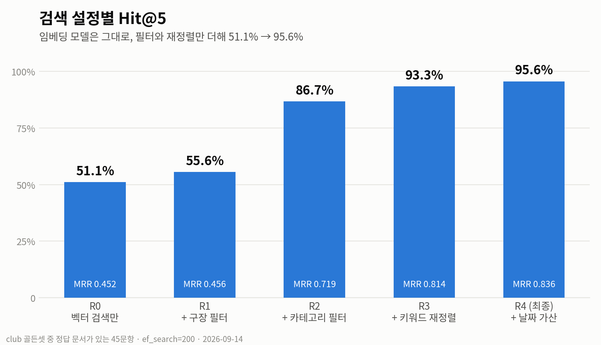

# 📦 산출물 4. 테스트 계획 및 결과 보고서

> KBO 직관 안내 챗봇 · SKN34 3차 5팀 · 기준일 2026-09-16 (develop)
> 결과 파일: [`docs/test_results/`](../test_results/) · 평가 코드: `rag_test/` · 단위 테스트: `backend/llm/rag/**/test_*.py`

---

## 1. 테스트 목표

| 목표 | 확인 질문 | 지표 |
| --- | --- | --- |
| **검색이 맞는 문서를 찾는가** | 정답 문서가 상위 k개 안에 들어오는가 | Hit@1·3·5, MRR |
| **답변이 사실인가** | 정답 키워드가 들어가고, 근거에 없는 숫자를 만들지 않는가 | 정답률, 지어낸 숫자 수 |
| **모를 때 모른다고 하는가** | 데이터에 없는 질문을 거절하고, 모호하면 되묻는가 | 거절·되묻기 정답률 |
| **틀린 전제에 휩쓸리지 않는가** | "삼성 3위 맞지?"처럼 틀린 말을 바로잡는가 | 함정 문항 정답률 |
| **느린 곳이 어디인가** | 검색 / 생성 시간을 나눠서 잰다 | 단계별 ms |
| **코드가 깨지지 않는가** | 프롬프트·파서·도구·SQL 검증·대체 경로 | 단위 테스트 통과 |

---

## 2. 테스트 계획

### 2-1. 단계 (rag_test STEP 1 ~ 5)

| 단계 | 스크립트 | 내용 | LLM 호출 |
| --- | --- | --- | :---: |
| STEP 1 | `step1_check_db.py` | 청크 수·카테고리 분포·임베딩 차원 확인 | 0 |
| STEP 2 | `step2_search_smoke.py` | 대표 질문 몇 개로 검색이 도는지 확인 | 0 |
| STEP 3 | `step3_check_golden.py` | 골든셋의 정답 doc_id가 실제 DB에 있는지 확인 | 0 |
| STEP 4 | `step4_eval_retrieval.py` | 검색 설정 R0 ~ R4를 **하나씩 추가**하며 비교 | 0 (질문 임베딩은 캐시) |
| STEP 5 | `step5_eval_generation.py` | 답변 생성 후 자동 채점 | 문항당 0 ~ 1 |

### 2-2. 골든셋

| 세트 | 문항 | 구성 |
| --- | ---: | --- |
| `golden_club.jsonl` | 55 | 반입 8 · 거절 8 · 규칙 6 · 일정 5 · 복합 5 · 가격 4 · 함정 4 · 순위 3 · 예매 3 · 좌석 2 · 재입장 2 · 별칭 2 · 모호 2 · 한계 1 |
| `golden_venue.jsonl` | 30 | club 위임 6 · 교통 5 · 구장 안 먹거리 5 · 모호 3 · 외부 먹거리 3 · 콘텐츠 3 · 긴 질문 3 · 편의시설 1 · 거절 1 |

**문항 형식**

```json
{"id": "c01", "group": "일정", "question": "9월 12일 잠실 경기 어디랑 해?",
 "expect": "answer", "stadium": "JAMSIL",
 "gold": ["SCHEDULE_JAMSIL_schedule_9ea6926b2aeef7d3"],
 "must": ["NC"], "grade": "THIRD_PARTY"}
```

| 필드 | 뜻 |
| --- | --- |
| `expect` | `answer`(답해야 함) / `refuse`(거절해야 함) / `clarify`(되물어야 함) / `correct`(틀린 전제를 바로잡아야 함) |
| `gold` | 정답 doc_id (정규식 허용) |
| `must` | 답변에 들어가야 하는 표현 중 하나 |
| `grade` | 정답 근거의 등급 → 비공식이면 경고 문구가 있어야 함 |

**설계 원칙**: 별칭("기아", "라팍")·오타·긴 구어체 질문을 일부러 섞고, **데이터에 없는 질문**(타율 1위, 선발 투수, 응원가 가사, 2027 개막일)을 넣어 거절 능력을 따로 봅니다.

### 2-3. 검색 설정 (한 번에 하나씩만 추가)

| 설정 | 구장 필터 | 카테고리 필터 | 키워드 재정렬 | 날짜 가산 |
| --- | :---: | :---: | :---: | :---: |
| R0_vector | | | | |
| R1_stadium | ✅ | | | |
| R2_category | ✅ | ✅ | | |
| R3_hybrid | ✅ | ✅ | ✅ | |
| R4_date | ✅ | ✅ | ✅ | ✅ |

### 2-4. 생성 채점 기준 (`scoring.py`)

| 판정 | 조건 |
| --- | --- |
| OK | `expect`에 맞게 행동 (답변이면 `must` 포함, 거절·되묻기·바로잡기면 해당 행동) |
| 오거절 | 답할 수 있는데 "정보가 없다"고 함 |
| 오답 | 답했지만 `must`가 없거나 사실과 다름 |
| 지어냄 | 거절해야 하는데 근거 없는 내용을 말함 |
| 숫자 대조 | 답변 속 숫자를 정답 청크 원문과 대조해 없는 숫자를 `bad_numbers`로 기록 |

### 2-5. 환경

| 항목 | 값 |
| --- | --- |
| 일시 | 검색 2026-09-14 05:17 · 생성 2026-09-14 05:46 |
| DB | PostgreSQL 18 + pgvector, 3,839청크, `ef_search=200` |
| 임베딩 / LLM | `text-embedding-3-small` / `gpt-5.6-luna` |
| 대상 체인 | `rag_test/chain.py` (club 도메인과 같은 로직) |

---

## 3. 결과

### 3-1. 검색 — 정답 문서가 있는 45문항

| 설정 | Hit@1 | Hit@3 | Hit@5 | MRR | 검색 시간 중앙값 |
| --- | ---: | ---: | ---: | ---: | ---: |
| R0_vector | 42.2% | 46.7% | 51.1% | 0.452 | 3.2 ms |
| R1_stadium | 40.0% | 48.9% | 55.6% | 0.456 | 5.9 ms |
| R2_category | 64.4% | 75.6% | 86.7% | 0.719 | 4.9 ms |
| R3_hybrid | 73.3% | 88.9% | 93.3% | 0.814 | 4.4 ms |
| **R4_date** | **75.6%** | **91.1%** | **95.6%** | **0.836** | 4.9 ms |

<p align="center"></p>
<p align="center"><sub>🔍 그림을 누르면 원본 크기로 볼 수 있어요</sub></p>


**그룹별 Hit@5 (R0 → R4)**

| 그룹 | 문항 | R0 | R4 |
| --- | ---: | ---: | ---: |
| 반입 | 8 | 37.5% | **100%** |
| 규칙 | 6 | 50.0% | **100%** |
| 일정 | 5 | 60.0% | **100%** |
| 가격 | 4 | 75.0% | **100%** |
| 함정 | 4 | 25.0% | **100%** |
| 예매 | 3 | 66.7% | **100%** |
| 순위 | 3 | 100% | **100%** |
| 재입장 · 별칭 · 좌석 | 각 2 | 0 ~ 50% | **100%** |
| 복합 | 5 | 80.0% | 80.0% |

**해석**

- **카테고리 필터가 가장 큰 효과**(+31.1%p). "반입"을 물었는데 가격·먹거리 문서가 섞이던 문제가 사라졌습니다.
- 구장 필터만으로는 거의 차이가 없었습니다(+4.5%p). 구장명은 이미 청크 본문 맨 앞에 들어 있어 임베딩이 어느 정도 구분하고 있었기 때문입니다.
- 키워드 재정렬은 Hit@1·MRR을 크게 올렸습니다(0.719 → 0.814). 정답이 top-5 안에 있어도 **1위로 올라와야** LLM이 우선 참고합니다.
- 복합 질문 1문항은 여러 주제를 한 번에 물어 한 카테고리 필터로는 다 담지 못했습니다 → 에이전트가 `search_kbo_documents`를 추가로 부르는 구조로 보완.
- 필터와 재정렬을 모두 켜도 검색 시간은 **5 ms 안팎**입니다.

### 3-2. 생성 — 55문항 전체

| expect | 문항 | OK | 오거절 | 오답 | 지어냄 | 정답률 |
| --- | ---: | ---: | ---: | ---: | ---: | ---: |
| answer | 41 | 38 | 2 | 1 | 0 | 92.7% |
| refuse | 8 | 7 | 0 | 0 | 1 | 87.5% |
| clarify | 2 | 2 | 0 | 0 | 0 | 100% |
| correct (함정) | 4 | 4 | 0 | 0 | 0 | 100% |
| **합계** | **55** | **51** | **2** | **1** | **1** | **92.7%** |

- **DB 직접 조회 경로**(일정·순위·함정 등 12문항)는 LLM 없이 답해 전부 정답, 응답 10 ms 안팎.
- 비공식 근거(재입장 등) 답변에는 현장·구단 확인 문구가 붙었습니다.

### 3-3. 응답 시간

| 구간 | 중앙값 | 평균 | 최대 |
| --- | ---: | ---: | ---: |
| 검색 | 9 ms | 10 ms | 29 ms |
| LLM 생성 | 2,643 ms | 2,556 ms | 10,971 ms |
| 전체 | 2,661 ms | 2,567 ms | 10,993 ms |

➡️ 전체 시간의 **99% 이상이 LLM 생성**. 벡터DB는 병목이 아닙니다.

### 3-4. assistant 에이전트 파이프라인 확인 (2026-09-15, 로컬 서버 · 게스트)

| 질문 | 사용된 도구 | 결과 | 시간 |
| --- | --- | --- | ---: |
| 오늘 이후 KIA 홈경기 몇 경기 남았어? | `get_games` | 7경기 + 목록 (CSV 직접 계산과 일치) | – |
| 잠실 주차 얼마야? | RAG | 소형 5분 200원 · 대형 400원, 15분 미만 무료, 약 680면 | 3.0 s |
| 지금 KBO 순위 알려줘 | `get_standings` | 기준일 1~10위 + 잠실 홈팀 순위 | 4.7 s |
| 친구랑 잠실 경기 전후 걸어서 코스 | `plan_course` | 음식점 → 구장 → 카페, 도보 1.2km, 지도 표시 | 6.6 s |
| 잠실 근처 숙소 추천 | `search_nearby_places` | 도보 8~9분 숙소 목록 (카카오) | 4.3 s |
| (채팅 화면) 여자친구랑 잠실 경기 전 걸어서 코스 | `plan_course` | 코스 카드 "도보 기준", 지도 자동 표시·되돌리기 동작 | – |

> 위 시간은 토큰 스트리밍 도입 전 측정입니다. 스트리밍 적용 후 재측정은 아래 3-4-1 참고.

#### 3-4-1. 스트리밍 파이프라인 재측정 (2026-09-16, 로컬 Docker · 질문 5개 × 2회, 2회차)

| 질문 | 도구 | 첫 글자 | 전체 | LLM 호출 |
| --- | --- | ---: | ---: | :---: |
| 잠실 주차 얼마야? | 없음 | 4.3 s | 5.1 s | 2 |
| 야구 처음인데 스트라이크가 뭐야? | 없음 | 3.1 s | 5.2 s | 2 |
| 지금 KBO 순위 알려줘 | `get_standings` | 6.8 s | 8.8 s | 3 |
| 잠실 근처 숙소 추천 | `search_nearby_places` | 8.5 s | 11.1 s | 3 |
| 친구랑 잠실 경기 전후 걸어서 코스 짜줘 | `plan_course` | 16.1 s | 17.5 s | 4 + 외부 API |
| **중앙값** | | **6.8 s** | **8.8 s** | |

- 도구 계획 LLM 호출이 끝나야 답변 스트리밍이 시작되므로, 도구가 없는 질문도 첫 글자까지 3 ~ 4초가 걸립니다.
- 1회차 순위 질문은 OpenAI 응답 지연으로 25초 타임아웃 → club 도메인 대체 답변(27.1초). 실패 대체 경로 동작 확인.
- 측정: `dispatcher.stream()`을 직접 호출해 첫 조각 · 완료 시각 기록 (`Claude outputs/measure_speed.py`, 저장소 미포함). 골든셋 전체 재평가는 [남은 과제](#6-남은-과제)입니다.

### 3-5. 단위 · 회귀 테스트

| 테스트 | 건수 | 내용 |
| --- | ---: | --- |
| `llm.rag.assistant.test_assistant` | 28 | 프롬프트 조립, 파서, 도구 입력 검증, 실제 SQL 검증기로 고정 SQL 확인, 가짜 모델로 전체 흐름 · 스트리밍, 실패 시 대체 경로, 야구 단어가 섞인 무관 질문 차단 |
| `llm.test_progress` | 19 | 진행 이벤트 순서 · 민감값 제거 · 저장 · 권한별 공개 범위 · 연결 끊김 처리 |
| `llm.test_rag_domain_bindings` | 18 | 모든 답변 에이전트에 같은 도구 28개 연결, 도구 결과 전달 |
| `llm.rag.nearby.test_nearby` | 8 | 주변 장소 종류 판별 · 카카오 응답 처리 |
| `llm.rag.course.test_transport` | 12 | 이동 수단 판별 · 이동 시간 계산 |
| `llm.test_course_chain` | 13 | 출발지 기준 단계별 코스 · 구장 쪽 우선 · 산책 · 실내 · 숙박 단계 · 접두어 분리 · 국외 좌표 무시 |
| `baseball.tests.test_query_service` | – | SQL 검증기: 거부 22건 유지(`pg_sleep`, 단독 `IF()` 등) + `AND/OR/CASE` 허용 |
| `accounts.test.*` | – | 로그인 · 토큰 · 로그아웃 회귀 |
| CI (GitHub Actions) | – | PR마다 `manage.py check` + `next build` |

```bash
cd backend
python manage.py test llm.rag.assistant.test_assistant llm.test_progress llm.test_rag_domain_bindings
python -m unittest llm.rag.nearby.test_nearby
python -m unittest llm.rag.course.test_transport
python manage.py test llm.test_course_chain
python manage.py test baseball.tests.test_query_service
```

> ✏️ **TODO**: 제출 전 위 명령을 한 번 실행하고 통과 결과(스크린샷 또는 로그)를 `docs/test_results/`에 넣어 주세요.

---

## 4. 실패 사례 분석

| ID | 질문 | 판정 | 원인 | 대응 |
| --- | --- | --- | --- | --- |
| c14 | 사직 1루 내야상단석 평일 일반 가격 얼마야? | 오거절 | 검색은 성공(상단석·필드석 문서가 top-5 안). 롯데 가격표의 구역 이름이 "내야필드석"과 색상형 등급으로 나뉘어 있어 LLM이 "상단석 가격은 없다"고 판단 | 에이전트의 `get_ticket_prices(zone_keyword)`로 구역 이름을 DB에서 직접 찾게 함 |
| c40 | 두산 다음 홈경기 언제야? | 오답 | "다음"을 **평가 기준일(9/13)이 아닌 데이터 기준일**로 계산해 날짜가 어긋남 (`bad_numbers`: 16·18·30·13) | 프롬프트에 오늘 날짜를 넣고 `get_games(status="upcoming")`로 계산하도록 변경 |
| c50 | 포항 구장 주차 어때? | 지어냄 | 포항 특별경기는 주변 데이터가 없어 거절해야 하는데, "경기 일정은 바로 알려드릴 수 있어요"라는 확인되지 않은 제안을 덧붙임 | 포항 예외 문구를 고정 문장으로 교체 (`포항_특별경기_예외처리.md`) |
| c53 | 9월 12일 잠실 경기 누가 홈이고 소주 사가도 돼? | 오거절 | 홈팀은 맞췄지만, 공통 규정의 "주류: 미개봉 PET 1개 또는 캔 2개"를 소주에 적용하지 못함 | 반입 규정 문장에 주종 예시(소주·맥주·막걸리) 보강 필요 → [남은 과제](#6-남은-과제) |

---

## 5. 결론

1. **검색 품질은 메타데이터 설계로 끌어올렸다.** 임베딩 모델을 바꾸지 않고 필터와 재정렬만으로 Hit@5를 51.1% → 95.6%로 올렸습니다.
2. **환각 방어가 동작한다.** 거절 8문항 중 7, 되묻기 2/2, 함정 4/4를 통과했고, 날짜·순위처럼 틀리기 쉬운 질문은 DB 조회로 돌려 전부 맞혔습니다.
3. **느린 곳은 LLM이다.** 검색은 10 ms 안팎이라, 속도 개선은 LLM 호출 수를 줄이는 방향으로 해야 합니다.

---

## 6. 남은 과제

- [ ] assistant 에이전트 파이프라인으로 골든셋 전체(club 55 + venue 30) 재평가, 이전 결과와 정확도·속도 비교
- [ ] `rag_test`가 백엔드 패키지를 직접 import하도록 정리 (지금은 수동 동기화)
- [ ] 반입 규정 주종 예시 보강 후 c53 재검증
- [ ] LangSmith 데이터셋 평가(`manage.py langsmith_eval`) 결과 첨부
- [ ] 단위 테스트 실행 로그 첨부

---

## 부록. 결과 파일

| 파일 | 내용 |
| --- | --- |
| `docs/test_results/retrieval_ef200_0914_0517.csv` | 검색 평가 원본 (5개 설정 × 55문항 = 275행) |
| `docs/test_results/generation_0914_0546.csv` | 생성 평가 원본 (55행: 질문·답변·판정·시간) |
| `docs/test_results/golden_club.jsonl`, `golden_venue.jsonl` | 골든셋 |

> `rag_test/results/`는 `.gitignore` 대상이라, 최종 결과만 `docs/test_results/`로 복사했습니다.
